# Dine første steg i mining!

I denne opplæringen vil vi dykke ned i gruveindustrien for å avmystifisere dette komplekse emnet! Opplæringen er tilgjengelig for alle og krever ingen innledende investering.

Den første delen vil være teoretisk, hvor Ajelex og jeg vil ha en grundig diskusjon om ulike emner relatert til mining. Dette vil hjelpe oss å bedre forstå denne industrien og de økonomiske og geopolitiske problemstillingene knyttet til den.
I den andre delen vil vi ta for oss en praktisk sak. Faktisk vil vi lære hvordan vi kan transformere en brukt S9 miner til et hjemmevarmesystem! Gjennom skriftlige guider og videoer vil vi vise og forklare alle stegene for å oppnå dette hjemme :)

Gjennom denne videoen håper vi å vise deg at gruveindustrien er mer kompleks enn den ser ut som, og å studere den bidrar til å nyansere den økologiske debatten som er knyttet til den!
Hvis du trenger hjelp med oppsettet ditt, har en Telegram-gruppe blitt opprettet for studenter, og alle nødvendige komponenter kan finnes på vår e-handelsplattform!

+++

# Introduksjon

<partId>a99dc130-3650-563f-8d42-a0b5160af0ab</partId>

## Velkommen!

<chapterId>7ad1abeb-a190-5c85-8bff-44df71331e4d</chapterId>

Velkommen til MINING 201: en introduksjon til mining. Ajelex, Jim & Rogzy er spente på å følge deg i dine første konkrete steg i denne nye industrien. Vi håper du nyter kurset og blir med på eventyret med hjemmemining!

### Kurs Oversikt

I dette kurset vil den første delen fokusere på teorien om mining med Ajelex. Vi vil ha grundige diskusjoner om ulike emner relatert til mining, som vil hjelpe oss å bedre forstå denne industrien og de økonomiske og geopolitiske problemstillingene knyttet til den.

I den andre delen vil vi begi oss ut på en fascinerende praktisk sak, lære hvordan vi kan transformere en brukt S9 miner til et hjemmevarmesystem. Gjennom skriftlige guider og videoer vil alle nødvendige steg bli nøye forklart, og sikre din suksess i dette innovative prosjektet.

Denne læringsreisen vil vise deg at gruveindustrien er mer kompleks enn den ser ut som, og tilbyr et balansert perspektiv på den økologiske debatten knyttet til den. Løpende assistanse vil være tilgjengelig gjennom en dedikert Telegram-gruppe for studenter, og alle nødvendige komponenter vil være lett tilgjengelige på vår e-handelsplattform.

### Pensum:

Teoretisk Seksjon:

- Forklaring av mining.
- Gruveindustrien.
- Nyanser av gruveindustrien.
- Mining i Bitcoin-protokollen.
- Bitcoin Pris og Hashrate, en Korrelasjon? Suverenitet og Regulering
- Intervju med en profesjonell innen gruveindustrien

Praktisk Seksjon: Attakai

- Introduksjon til Attakai.
- Kjøpsguide.
- Modifisering av programvaren til en Antminer S9.
- Bytte av vifter for å redusere støy.
- Pool-konfigurasjon.
- Konfigurering av Antminer S9 med Braiins OS+.

Klar til å begi deg ut på dette fengslende eventyret? La oss dykke sammen inn i den fascinerende verdenen av hjemmemining!

# Alt du trenger å vite om Mining

<partId>aa99ef2c-da29-5317-a533-2ffa4f66f674</partId>

## Forklaring av Mining

<chapterId>36a82de7-87ee-5e7a-b69e-48fc30030447</chapterId>

### Mining Forklart: Puslespillanalogien

For å forklare konseptet med mining på en forenklet måte, kan en relevant analogi brukes: den om et puslespill. Akkurat som et puslespill, er mining en kompleks oppgave å utføre, men enkel å verifisere når den er fullført. I konteksten av Bitcoin-mining, streber minerne etter å raskt løse et digitalt puslespill. Den første miner som løser puslespillet, presenterer sin løsning for hele nettverket, som da enkelt kan verifisere gyldigheten. Denne vellykkede verifiseringen tillater mineren å validere en ny blokk og legge den til i Bitcoin Timechain. Som anerkjennelse for deres arbeid, som innebærer betydelige kostnader, blir mineren belønnet med et visst antall bitcoins. Denne belønningen fungerer som en økonomisk insentiv for minerne til å fortsette sitt arbeid med å validere transaksjoner og sikre Bitcoin-nettverket.

I begynnelsen av Bitcoin-nettverket, var den tildelte belønningen 50 bitcoins hvert tiende minutt, parallelt med oppdagelsen av en blokk hvert tiende minutt i gjennomsnitt av minerne. Denne belønningen gjennomgår en halvering hver 210 000 blokker, omtrent hvert fjerde år. Denne godtgjørelsen fungerer som en kraftig insentiv for å oppmuntre minerne til å delta i miningprosessen til tross for dens energikostnad. Uten en belønning, ville den energikrevende miningen bli forlatt, noe som kompromitterer sikkerheten og stabiliteten til hele Bitcoin-nettverket.
Den nåværende miningbelønningen er todelt. På den ene siden inkluderer den skapingen av nye bitcoins, som har redusert fra 50 bitcoins hvert tiende minutt i begynnelsen til 6,25 bitcoins i dag (2023). På den andre siden inkluderer den transaksjonsgebyrer, eller mininggebyrer, fra transaksjonene som mineren velger å inkludere i sin blokk. Når en bitcoin-transaksjon blir gjort, betales transaksjonsgebyrer. Disse gebyrene fungerer som en slags auksjon hvor brukerne angir hvor mye de er villige til å betale for å få sin transaksjon inkludert i neste blokk. For å maksimere sin belønning, velger minerne, som handler i egen interesse, de mest lønnsomme transaksjonene å inkludere i sin blokk, med tanke på det begrensede tilgjengelige rommet. Således består miningbelønningen av både genereringen av nye bitcoins og transaksjonsgebyrer, noe som sikrer en kontinuerlig insentiv for minerne og sikrer Bitcoin-nettverkets levetid og sikkerhet.

### Minerne og Deres Verktøy: Mining

Miningprosessen innebærer å finne en gyldig hash som er akseptabel for Bitcoin-nettverket. Når den er beregnet og funnet, er denne hashen uopprettelig, lik poteter som blir til potetmos. Den verifiserer en viss funksjon uten mulighet for å gå tilbake. Minerne, i konkurranse, bruker maskiner for å beregne disse hashene. Selv om det teoretisk er mulig å finne denne hashen manuelt, gjør kompleksiteten i operasjonen dette alternativet uoverkommelig. Datamaskiner, som er i stand til å utføre disse beregningene raskt, brukes derfor, og forbruker en betydelig mengde elektrisitet.

I begynnelsen dominerte CPU-æraen, hvor minerne brukte sine personlige datamaskiner for Bitcoin-mining. Oppdagelsen av fordelene med GPUer (grafikkort) for denne oppgaven markerte et vendepunkt, og økte hashraten betydelig og reduserte energiforbruket. Fremgangen stoppet ikke der, med den påfølgende introduksjonen av FPGAer (field-programmable gate arrays). FPGAer tjente som en plattform for utviklingen av ASICer (application-specific integrated circuits).

ASIC-er er brikker, sammenlignbare med en CPU-brikke, men de er utviklet for å utføre kun én spesifikk type beregning på den mest effektive måten mulig. Med andre ord, en CPU er i stand til å utføre en mengde forskjellige typer beregninger uten å være spesielt optimalisert for én type beregning eller en annen, mens en ASIC vil være i stand til å utføre kun én type beregning, men veldig effektivt. I tilfellet med Bitcoin ASIC-er, er de designet for beregningen av SHA256-algoritmen. I dag bruker gruvearbeidere utelukkende ASIC-er dedikert til denne operasjonen, optimalisert for å teste det maksimale antallet kombinasjoner med det minst mulige energiforbruket og så raskt som mulig. Disse datamaskinene, som er ute av stand til å utføre oppgaver annet enn Bitcoin-mining, er et håndfast vitnesbyrd om den kontinuerlige utviklingen og økende spesialiseringen av Bitcoin-miningindustrien. Denne konstante utviklingen reflekterer Bitcoin sin intrinsikke dynamikk, hvor en vanskelighetsjustering sikrer produksjonen av en blokk hvert tiende minutt til tross for den eksponentielle økningen i miningkapasitet.

For å illustrere intensiteten av denne prosessen, vurder en typisk gruvearbeider som er i stand til å oppnå 14 TeraHash per sekund, eller 14 billioner forsøk hvert sekund for å finne den korrekte hashen. I skalaen til Bitcoin-nettverket, når vi nå omtrent 300 HexaHash per sekund, noe som fremhever den kollektive kraften mobilisert i Bitcoin-mining.

### Vanskelighetsjustering:

Vanskelighetsjustering er en avgjørende mekanisme i driften av Bitcoin-nettverket, som sikrer at blokker blir minet i gjennomsnitt hvert 10. minutt. Denne varigheten er et gjennomsnitt fordi miningprosessen faktisk er et spill med sannsynligheter, likt med å kaste terninger i håp om å få et tall lavere enn tallet definert av vanskeligheten. Hver 2016 blokker, justerer nettverket miningvanskeligheten basert på gjennomsnittstiden som kreves for å mine de foregående blokkene. Hvis gjennomsnittstiden er større enn 10 minutter, reduseres vanskeligheten, og omvendt, hvis gjennomsnittstiden er lavere, økes vanskeligheten. Denne justeringsmekanismen sikrer at miningtiden for nye blokker forblir konstant over tid, uavhengig av antall gruvearbeidere eller den samlede databehandlingskraften til nettverket. Dette er grunnen til at Bitcoin Blockchain også kalles Timechain.

- Eksempel fra Kina:
  Tilfellet med Kina illustrerer perfekt denne vanskelighetsjusteringsmekanismen. Med rikelig og billig energi, var Kina det viktigste globale knutepunktet for Bitcoin-mining. I 2021 forbød landet plutselig Bitcoin-mining på sitt territorium, noe som resulterte i et massivt fall i den globale Bitcoin-nettverkets hashrate, rundt 50%. Denne raske nedgangen i miningkraft kunne ha alvorlig forstyrret Bitcoin-nettverket ved å øke gjennomsnittstiden for mining av blokker. Imidlertid trådte vanskelighetsjusteringsmekanismen i kraft, og reduserte miningvanskeligheten for å sikre at blokkminingfrekvensen forblir på et gjennomsnitt på 10 minutter. Dette tilfellet demonstrerer effektiviteten og motstandsdyktigheten til Bitcoins vanskelighetsjusteringsmekanisme, som sikrer nettverkets stabilitet og forutsigbarhet, selv i møte med plutselige og betydelige endringer i det globale mininglandskapet.

### Utviklingen av Bitcoin Mining-maskiner

Når det gjelder utviklingen av Bitcoin-miningmaskiner, er det viktig å merke seg at konteksten er mer orientert mot en tradisjonell forretningsmodell. Gravere tjener sin inntekt fra blokkvalidering, en oppgave med relativt lav sannsynlighet for suksess. Den nåværende modellen i bruk, Antminer S9, selv om det er en eldre modell lansert rundt 2016, er fortsatt i omløp på det brukte markedet, og handles for rundt €100 til €200. Imidlertid varierer prisen på miningmaskiner basert på verdien av Bitcoin, og en nyere modell, Antminer S19, er for øyeblikket estimert til rundt €3000.
Stilt overfor konstante teknologiske fremskritt innen gruvefeltet, må fagfolk strategisk posisjonere seg. Gruveindustrien er underlagt kontinuerlige innovasjoner, som demonstrert ved den nylige utgivelsen av J-versjonen av S19 og den forventede utgivelsen av S19 XP, som tilbyr betydelig høyere gruvekapasiteter. Videre er forbedringer ikke bare relatert til maskinenes rå ytelse. For eksempel bruker den nye S19 XP-modellen et væskekjølingssystem, en teknisk modifikasjon som tillater en betydelig forbedring i energieffektivitet. Selv om innovasjon forblir en konstant, vil fremtidige effektivitetsgevinster sannsynligvis være mindre sammenlignet med de som er observert så langt, på grunn av å nå en viss terskel for teknologisk innovasjon.

Konklusjonen er at Bitcoin-gruveindustrien fortsetter å tilpasse seg og utvikle seg, og aktører i bransjen må forutse avtagende effektivitetsgevinster i fremtiden og justere strategiene sine deretter. Fremtidige teknologiske fremskritt, selv om de fortsatt er til stede, vil sannsynligvis skje i mindre skala, noe som reflekterer sektorens voksende modenhet.

## Gruveindustrien

<chapterId>0896dfc1-c97e-5bec-9bf1-8c20b3388a2c</chapterId>

### Gruvebassenger

For tiden har Bitcoin-gruvedrift utviklet seg til en seriøs og betydelig industri, med mange aktører nå offentlig kjent og et økende antall betydelige gruvearbeidere. Denne utviklingen har gjort gruvedrift nesten utilgjengelig for små aktører på grunn av de høye kostnadene forbundet med å anskaffe nye gruvemaskiner. Dette reiser spørsmålet om fordelingen av hashrate blant ulike markedsaktører. Situasjonen er kompleks fordi det er essensielt å undersøke både fordelingen av hashrate blant forskjellige selskaper og blant forskjellige gruvebassenger.

Et gruvebasseng er en gruppe gruvearbeidere som kombinerer sine databehandlingsressurser for å øke sjansene sine for å utvinne. Dette samarbeidet er nødvendig fordi en isolert liten gruvemaskin konkurrerer mot industriens giganter, noe som reduserer dens sjanser for suksess til et ubetydelig nivå. Gruvedrift fungerer på et lotteriprinsipp, og sjansene for å vinne en blokk (og dermed Bitcoin-belønningen) hvert tiende minutt er ekstremt lave for en individuell liten gruvearbeider. Ved å slå seg sammen, kan gruvearbeidere kombinere sin databehandlingskraft, finne blokker oftere og deretter distribuere belønningene proporsjonalt til hver gruvearbeiders bidrag til bassenget.

For eksempel, hvis et basseng finner en blokk og vinner 6,25 bitcoins, ville en gruvearbeider som bidrar med 1% av bassengets totale databehandlingskraft motta 1% av de 6,25 tjente bitcoins. Det bør imidlertid bemerkes at gruvebassenger generelt tar en liten kommisjon (vanligvis rundt 2%) for å dekke driftskostnadene til kooperativet.

### Programvare brukt av industrien

I konteksten av Bitcoin-gruvedrift er rollen til programvare like avgjørende som maskinvare. Et eksempel på dette er illustrert ved rollen til Bitmain, en produktiv produsent som utviklet Antminer S9. I tillegg til gruveutstyr, er industrien sterkt avhengig av samarbeidende gruvebassenger, som Brainspool, som kontrollerer omtrent 5% av den globale hashraten til Bitcoin-nettverket.
Aktørene i denne industrien søker konstant å øke effektiviteten gjennom maskinvare og programvare. For eksempel er et populært programvare brukt i denne sammenhengen BrainsOS Plus. Denne programvaren erstatter gruvemaskinens originale operativsystem, slik at de samme operasjonene kan utføres mer effektivt. Med slik programvare kan en gruvearbeider øke effektiviteten til maskinen sin med 25%. Dette betyr at for en tilsvarende mengde elektrisitet, kan maskinen produsere en ekstra 25% av hashrate, og dermed øke belønningene mottatt av gruvearbeideren. Denne programvareoptimaliseringen er et essensielt element av konkurranseevne i Bitcoin-gruvedrift, og demonstrerer viktigheten av en integrert tilnærming som kombinerer både maskinvare- og programvareforbedringer for å maksimere effektivitet og avkastning.

### Regulering og Elektrisitetstariffer

Som observert i Kina og andre steder, har regulering en betydelig innflytelse på mining. Selv om det ikke er betydelige minere i Frankrike, er regulering og høye elektrisitetstariffer i Europa store hindringer. Minere søker konstant etter billig elektrisitet for å maksimere sine profitter. Derfor tiltrekker ikke den høye kostnaden for elektrisitet i Europa og Frankrike minere til disse regionene.

Minere har en tendens til å trekkes mot regioner med lave elektrisitetstariffer, ofte i fremvoksende land eller land med energioverskudd. For eksempel er en stor del av den globale hashraten lokalisert i Texas, USA. Texas har et uavhengig strømnett som ikke deler sine energiressurser med andre stater. Denne unikheten fører ofte til at Texas produserer mer elektrisitet enn nødvendig for å unngå mangel, noe som skaper et overskudd. Bitcoin-minere tar fordel av denne overproduksjonen ved å etablere operasjoner i Texas, hvor de kan mine bitcoins til svært lave elektrisitetspriser i perioder med energioverskudd. Denne situasjonen demonstrerer den betydelige innflytelsen av reguleringer og elektrisitetstariffer på Bitcoin-mining, og understreker viktigheten av disse faktorene i minernes beslutningsprosess angående plasseringen av deres miningoperasjoner.

### Hvor går minerne og energistyring?

Ved å fremheve innvirkningen av Bitcoin-minere i energiverdenen, er banen klar: disse aktørene søker konstant etter kilder til billig elektrisitet, ofte de som er bortkastet eller uutnyttet. Dette fenomenet er tydelig i regioner med ny elektrisk infrastruktur, som de som er utstyrt med nylige vannkraftverk.

La oss ta et eksempel. I et land som er i ferd med å bygge en demning, starter ofte elektrisitetsproduksjonen før distribusjonslinjene er fullt operasjonelle. Dette tidsrommet kan resultere i betydelige kostnader og avskrekke investeringer i slike infrastrukturprosjekter. Imidlertid kan bitcoin-minere fungere som en fleksibel etterspørselskilde, klar til å konsumere denne "foreldreløse" elektrisiteten, og dermed bidra til å dekke infrastrukturkostnadene. Implikasjonen her er at nye installasjoner kan være umiddelbart lønnsomme, og fremme skapelsen av nye elektrisitetskilder. Dette prinsippet gjelder også i mindre skalaer. Enten det er en enkeltperson som bruker en vannkraftgenerator på en liten elv eller et hushold utstyrt med solcellepaneler, kan den overskytende elektrisiteten som produseres brukes til å drive bitcoin-miningoperasjoner.

I Frankrike, for eksempel, injiseres overskuddselektrisitet fra solcellepaneler tilbake i nettet, og produsentene kompenseres med et forbrukskreditt fra EDF. På samme måte kan man forestille seg en miner som opererer på denne overskuddselektrisiteten, og slår seg av når lokal etterspørsel tilsvarer tilbudet. Selv om dette kan virke egoistisk, prioritere bitcoin-produksjon over å støtte det lokale strømnettet, presenterer det en annen vinkel: stabilisering av strømnettet. Den komplekse håndteringen av overskuddselektrisitet, noen ganger til og med med tilknyttede kostnader for bortskaffelse, kan forenkles betydelig. Bitcoin-minere kan absorbere disse overskuddene, og fungere som en fleksibel buffer, justere etterspørsel heller enn tilbud. I en verden hvor elektrisitetsproduksjon fra fornybare (ikke-kontrollerbare) kilder stadig øker, kan minerne spille en nøkkelrolle i å sikre balansen i våre strømnett, samtidig som de drar nytte av billig eller overskuddselektrisitet for å drive sine miningoperasjoner.

### Mining-sentralisering

Mining-sentralisering adresseres som en stor utfordring. Store aktører, som Foundry, dominerer markedet, noe som potensielt kan føre til transaksjonssensur. Denne sentraliseringen kan også gjøre nettverket sårbart for angrep, inkludert 51%-angrepet, hvor en aktør eller gruppe kontrollerer mer enn 50% av nettverkets hashingkraft, noe som tillater dem å kontrollere og manipulere nettverket.

Reguleringsrisiko Det understrekes at hvis et land som USA skulle bestemme seg for å regulere eller forby visse Bitcoin-transaksjoner, kunne det ha en betydelig innvirkning på nettverket, spesielt hvis en stor del av hashingkraften er sentralisert i det landet.

For å bekjempe denne sentraliseringen diskuteres ulike strategier:

- Hjemmeutvinning: Ideen om hjemmeutvinning er basert på desentraliseringen av utvinningsaktivitet. Det oppmuntrer enkeltpersoner til å delta i utvinning fra sine hjem, og distribuerer dermed hashraten mer bredt.
- Stratum V2: Stratum V2-protokollen tilbyr en annen tilnærming. I motsetning til sin forgjenger, tillater Stratum V2 at gruvearbeidere kan velge hvilke transaksjoner de vil inkludere i blokkene de utvinner. Denne evnen styrker motstanden mot sensur og reduserer evnen store gruvebassenger har til å dominere nettverket. Ved å gi mer makt til individuelle gruvearbeidere, kan Stratum V2-protokollen spille en avgjørende rolle i kampen mot sentralisering av hashrate.
  Åpen kildekode for gruveprogramvare
- Åpen kildekode for gruveprogramvare: Dette er en annen potensielt effektiv strategi. Ved å gjøre gruveprogramvare tilgjengelig for alle, ville små gruvearbeidere ha de samme mulighetene som store gruveselskaper til å delta og bidra til blockchain-nettverket. Denne tilnærmingen ville oppmuntre til en bredere distribusjon av hashrate, og dermed bidra til nettverksdesentralisering.
- Diversifisering av aktører og geografi: Å oppmuntre deltakelsen av ulike aktører fra forskjellige geografiske regioner i kryptovaluta-utvinning kan også vise seg å være effektivt. Ved å diversifisere hashraten geografisk, blir det vanskeligere for en enkelt aktør eller land å utøve uforholdsmessig kontroll eller innflytelse over nettverket. Denne tilnærmingen kan bidra til å beskytte nettverket mot potensielle angrep og styrke dets desentralisering.

Den generelle konklusjonen er at desentralisering er avgjørende for sikkerheten og motstandsdyktigheten til Bitcoin-nettverket. Selv om sentralisering kan tilby effektivitetsfordeler, eksponerer det nettverket for betydelige risikoer, inkludert sensur og 51% angrep. Initiativer som Takai og adopsjonen av nye protokoller som Stratum V2 er viktige skritt mot desentralisering og beskyttelse av Bitcoin-nettverket mot disse truslene.

## Nyanser av gruveindustrien

<chapterId>7b9ee427-316a-54e3-a2d4-4ea97839a31b</chapterId>

### Prinsippet om Attakai

I den nåværende konteksten kan Bitcoin-utvinning med S9-modellen virke kompleks, men en dypere analyse åpner døren for innovative alternativer. Attakai-prinsippet er basert på å vurdere bruken av utvinningsinstallasjoner i ulike typer bygninger, som skoler eller sykehus. Hovedideen er å plassere noen få utvinningsmaskiner på forskjellige steder, og dermed gjenbruke varmen som disse maskinene avgir for å varme opp etablissementene. Ved å velge mer effektive modeller som S19, ville det være mulig å distribuere utvinningsaktiviteten, og dermed forbedre den samlede ytelsen samtidig som man også bidrar nyttig til samfunnet. Dette initiativet har som mål å konkurrere med store sentraliserte utvinningsoperasjoner ved å bruke varmen som genereres av utvinningsmaskiner på en produktiv og effektiv måte.

Attakai-initiativet stammer fra et personlig hjemmeutvinnings-eksperiment utført av to venner ivrige etter å aktivt delta i Bitcoin-nettverket. De møtte store hindringer, som høye støynivåer fra utvinningsutstyret, designet for industriell snarere enn hjemmebruk. For å adressere dette problemet, ble det gjort maskinvaremodifikasjoner på utvinningsmaskinene. Mer effektive og stillere vifter erstattet det opprinnelige utstyret, noe som gjorde hjemmeutvinning mer tilgjengelig og mindre forstyrrende. I tillegg eliminerte inkluderingen av en Wi-Fi-adapter behovet for en kablet Ethernet-tilkobling, noe som ytterligere forenklet hjemmeutvinningsprosessen. Om vinteren ble disse modifiserte minerne brukt som en varmekilde, og omdannet en ulempe til en fordel.
Etter å ha presentert prosjektet sitt for Bitcoin-samfunnet og sett interessen det genererte, bestemte oppfinnerne av Attakai seg for å publisere detaljerte guider på Découvre Bitcoin-plattformen, slik at hvem som helst kan replikere deres hjemme-mining-opplevelse. De planlegger nå å utvide dette konseptet utover hjemmeinnstillingen. Målet er å demonstrere hvordan en modifisert miner kan transformeres til en stille hjelpevarmer som kan brukes i løpet av vinteren, og tilby en jevn overgang til en andre del av opplæringen, fokusert på den praktiske implementeringen av disse modifikasjonene, illustrert av forklarende videoer. Spørsmålet gjenstår imidlertid om denne initiativet kan utvides i større skala, og tilby et realistisk og bærekraftig alternativ til dagens sentraliserte mining-strukturer.

### Grensen for denne desentraliseringen?

Selv om ideen om å desentralisere mining gjennom produktiv bruk av generert varme virker lovende, har den visse begrensninger og spørsmål gjenstår. Energiintensive etablissementer som badstuer og bassenger kunne dra nytte av dette konseptet ved å bruke varmen som produseres av minerne til å varme opp vannet i anleggene sine. Denne praksisen blir allerede implementert av noen medlemmer av Bitcoin-samfunnet, som utforsker forskjellige metoder for effektivt å utnytte varmen generert av mining-utstyr. For eksempel, kunne et festlokale teoretisk sett varmes opp av tre eller fire S19-minere, hver med et forbruk på 3000 watt og produserer en tilsvarende mengde varme.

Det bør imidlertid bemerkes at energiforbruk og varmeproduksjon er ekvivalente, enten energien brukes av en elektrisk varmer eller en miner. For hver kilowatt strøm som brukes, vil mengden varme som produseres være den samme i begge tilfeller. Forskjellen ligger i det faktum at mineren ikke bare gir varme, men også en bitcoin-belønning, og dermed tilbyr en økonomisk insentiv til å bruke en miner i stedet for en enkel elektrisk varmer. Denne ekstra belønningen kunne bidra til å lindre bekymringer om høyt energiforbruk av minere.

Spørsmålet om langsiktig effektivitet og gjennomførbarhet av å bruke bitcoin-minere for oppvarming forblir åpent. Pågående innovasjoner i mining-maskinvare og oppvarmingsteknologier kan potensielt åpne nye veier for mer effektiv bruk av varmen generert av mining, og dermed bidra til levedyktigheten av denne tilnærmingen i fremtiden.

### Hvorfor Ha BTC-belønninger?

Spørsmålet om belønning i bitcoin i stedet for en annen valuta er essensielt i systemet forestilt av Satoshi Nakamoto. Opprettelsen av Bitcoin er kjennetegnet ved en fast grense på 21 millioner enheter. Målet var å finne en rettferdig måte å distribuere disse nyopprettede enhetene på. Minere, ved å tilby sin databehandlingskraft for å sikre nettverket og gjøre ethvert angrep stadig mer kostbart, beskytter effektivt Bitcoin-nettverket. Som gjenytelse for dette avgjørende bidraget, blir de belønnet med nyopprettede bitcoins, noe som letter distribusjonen av mynter innen økosystemet.

Det er et vinn-vinn-system. Minere blir belønnet for både å sikre nettverket og godkjenne transaksjoner. De nyopprettede bitcoinene gis som et insentiv for å styrke sikkerheten, og transaksjonsgebyrer er en ekstra inntekt for å godkjenne transaksjoner. Disse to elementene kombinert utgjør den totale belønningen for mining. Spørsmålet om miningens fremtid oppstår på grunn av den programmerte reduksjonen av mining-belønninger, halvering hvert fjerde år, en hendelse kjent som "halving". Inn i 2032 vil blokkbelønningen være mindre enn en bitcoin, og innen 2140 vil ingen nye bitcoins bli skapt. På dette tidspunktet vil minerne stole utelukkende på transaksjonsgebyrer for kompensasjon. Bitcoin-nettverket vil trenge å støtte et stort antall transaksjoner, med tilstrekkelig høye gebyrer, for å sikre mining-lønnsomhet.
Økningen av Lightning Network, som muliggjør raske og kostnadseffektive transaksjoner utenfor hovedkjeden til Bitcoin, reiser spørsmål om fremtiden for gruvedrift. Lightning Network har potensial til å redusere transaksjonsgebyrer betydelig, noe som dermed kan påvirke gruvearbeidernes inntekt. Dette vil imidlertid avhenge av adopsjonen og bruken av Lightning Network sammenlignet med hovednettverket til Bitcoin. I et pessimistisk scenario kan gruvearbeidere finne det lønnsomt å mine selv med tap hvis de har amortisert sine kostnader og har tilgang til billig elektrisitet. I et mer optimistisk scenario kan transaksjonsgebyrer på hovednettverket til Bitcoin forbli høye nok til å opprettholde lønnsomheten ved gruvedrift.

### Hva bør inkluderes i en Bitcoin-blokk?

Når det gjelder spørsmålet om hva som bør inkluderes i en Bitcoin-blokk, er det avgjørende å vurdere det komplementære forholdet mellom de forskjellige lagene i Bitcoin-nettverket. Selv om Lightning Network kan muliggjøre raskere og billigere transaksjoner, er det fortsatt avhengig av grunnlaget til Bitcoin, ofte referert til som "oppgjørslaget", for å åpne og lukke betalingskanaler.

Med den forventede veksten av Lightning Network og den påfølgende økningen i åpninger og lukkinger av kanaler, vil plassen i Bitcoin-blokker bli stadig mer verdifull. Bitcoin-samfunnet har allerede en tendens til å verdsette bevaringen av denne plassen, og anerkjenner dens iboende begrensning. Denne bevisstheten har ført til diskusjoner om legitim bruk av blokkplass, med bekymringer om "spam" på blokkjeden fra transaksjoner som anses som ikke-essensielle.

Det spekuleres i fremtidig bruk av blokkplass, men det er generelt akseptert at det er en knapp ressurs som bør brukes klokt. Selv om det er et ønske om å fylle den, er det essensielt å bevare den for å sikre Bitcoin-nettverkets langsiktige levedyktighet, i forventning om en fremtidig økning i etterspørselen etter blokkplass. Som i ethvert fritt marked, vil tilbud og etterspørsel regulere bruken av blokkplass. Med begrenset tilbud, må interessenter ta informerte valg om bruken av denne verdifulle plassen for å sikre Bitcoin-nettverkets langsiktige effektivitet og sikkerhet.

## Bitcoin Mining i Bitcoin-protokollen

<chapterId>879a66b0-c20a-56b5-aad0-8a21be61e338</chapterId>

Rollen til gruvearbeidere i Bitcoin-nettverket har vært et emne for intens debatt under blokkstørrelseskrigene. Selv om de er essensielle for sikkerheten og funksjonaliteten til nettverket, holder ikke nødvendigvis gruvearbeiderne den ultimate makten i Bitcoin-økosystemet. Balansen mellom gruvearbeidere, noder og sluttbrukere sikrer integriteten og distribusjonen av nettverket.

### Blokkstørrelseskrigene

Under blokkstørrelseskrigene var mange gruvearbeidere imot visse utviklinger i nettverket, noe som fremhevet spenningen mellom ulike aktører i økosystemet. Spørsmålet gjenstår om hvordan man balanserer makt blant gruvearbeidere, noder og brukere for å sikre Bitcoin sin langsiktige sikkerhet.

Sikkerhetsdilemmaet til Bitcoin hviler på en delikat balanse. Mens gruvearbeidere spiller en avgjørende rolle i å validere og skape blokker, opprettholder noder integriteten ved å verifisere og validere transaksjoner og blokker. En feilaktig eller svindelaktig blokk vil bli avvist av nodene, og dermed sensurere gruvearbeideren og bevare nettverkets sikkerhet. Makten holdes også av nodene og brukerne av Bitcoin-nettverket. Noder har makten til verifisering og validering, mens brukere har makten til å velge hvilken blokkjede de vil bruke. Denne fordelingen av makt sikrer distribusjonen og integriteten til Bitcoin-nettverket.
Blockstørrelseskrigene avslørte usikkerheten og spenningen som er iboende i styringen av Bitcoin-nettverket. Selv om Bitcoin Core for øyeblikket er den dominerende kjeden, fortsetter debatten om styring og nettverksadministrasjon.

Til syvende og sist deles ansvaret blant alle aktører i Bitcoin-nettverket. En nedgang i antall brukere, noder eller gruvearbeidere kan svekke nettverket, øke risikoen for sentralisering og sårbarhet for angrep. Hver aktør bidrar til robustheten og sikkerheten til nettverket, noe som forsterker viktigheten av å opprettholde en balanse av makt og ansvar.

### Kraften til Gruvearbeidere

Satoshi Nakamotos elegante spillteori etablerte en situasjon hvor hver aktør i Bitcoin-nettverket er incentivert til å handle korrekt for å beskytte både sine egne interesser og de til andre deltakere. Dette skaper en balanse hvor dårlig oppførsel kan bli irettesatt, og dermed forbedre sikkerheten og stabiliteten til hele systemet. Til tross for denne balansen, forblir stater en potensiell trussel. Som indikert i presentasjonen på Surfing Bitcoin 2022, kan stater forsøke å angripe gruveindustrien, og eksponere Bitcoin-nettverket for risikoer for sentralisering og angrep. Hypotetiske scenarioer som et militært angrep som målretter produksjonsanlegg for gruveutstyr, understreker viktigheten av geografisk og industriell diversifisering for Bitcoin-nettverkets motstandsdyktighet.

Sentraliseringen av produksjonen av gruveutstyr i Kina utgjør en annen risiko. En nektelse av å eksportere gruvemaskiner eller en oppsamling av hashrate for et potensielt 51% angrep av Kina understreker behovet for diversifisert produksjon av gruveutstyr. Som respons på disse risikoene, utforsker Bitcoin-samfunnet aktivt løsninger. Selskaper som Intel vurderer å produsere gruveutstyr i USA, noe som bidrar til distribusjonen av produksjonen. Andre initiativer, som Blocks åpen kildekode Mining Development Kit (MDK), sikter mot å redusere monopolet på design og produksjon av gruveutstyr, og tillater en bredere distribusjon av hashrate. I hjertet av disse diskusjonene ligger Bitcoins grunnleggende oppdrag: å være et sensurresistent verdioverføringsnettverk. Bitcoin-samfunnet streber konstant etter å styrke distribusjon, motstand mot sensur og nettverkets anti-fragilitet, og avviser forslag som overgangen til proof of stake, som ikke er i tråd med disse grunnleggende prinsippene.

### Den Fysiske Koblingen av Proof of Work kontra Proof of Stake

Proof of Work (PoW) er essensielt fordi det representerer den fysiske koblingen mellom den virkelige verden og Bitcoin. Selv om bitcoins er immaterielle, krever deres produksjon konkret energi, og etablerer dermed en direkte forbindelse med den fysiske og virkelige verden. Denne forbindelsen sikrer at produksjonen og valideringen av bitcoins og blokker har en reell energikostnad, og dermed forankrer Bitcoin-nettverket i den fysiske virkeligheten og forhindrer dets fullstendige dominans av kraftige enheter. PoW fungerer som en bastion mot sentralisering, og sikrer at deltakelse i nettverket og validering av transaksjoner krever en investering i håndgripelige ressurser. Dette forhindrer monopoliseringen av nettverket av enheter som ellers kunne ta kontroll uten noen betydelig inngangsbarriere, og sikrer dermed en mer rettferdig fordeling av makt og innflytelse innen Bitcoin-nettverket.

### Begrensningene ved Proof of Stake

På den andre siden, selv om Proof of Stake (PoS) tillater deltakelse i liten skala, garanterer det ikke tilsvarende beskyttelse mot sentralisering. I et PoS-nettverk har de som allerede holder en stor mengde av valutaen uforholdsmessig stor makt, noe som reflekterer eksisterende maktulikheter i samfunnet for øvrig. Denne dynamikken kan potensielt videreføre sentralisering og konsentrasjon av makt i hendene på noen få, i strid med de grunnleggende distribusjonsmålene til Bitcoin-nettverket. Argumentet om at alle kan delta i PoS, selv i liten skala, ved å bli med i grupper, er ikke nødvendigvis robust. I et PoW-nettverk kan selv en liten bidragsyter, med beskjeden utstyr, aktivt delta og bidra til sikkerheten og distribusjonen av nettverket.

### Oppsummering

For å oppsummere, minerne styrker Bitcoin-nettverket mot sensur ved å bruke elektrisitet for å beregne Bitcoins proof of work, og belønnes med nye bitcoins og transaksjonsgebyrer. Med profesjonaliseringen av industrien, dukker det opp ulike aktører som spiller forskjellige roller, fra chipproduksjon til styring av miningfarmer. I tillegg spiller også finans en rolle, ved å utøve kontroll ved å bestemme hvem som overlever under forskjellige markedsfaser. Problemet med sentralisering vedvarer, med de rikeste enhetene som potensielt dominerer markedet. Imidlertid utvikles alternativer på både maskinvare- og programvarenivå. Det er opp til hver enkelt å handle og bidra til distribusjonen av nettverket. Bitcoin representerer en ekstraordinær mulighet ikke bare med tanke på frihet, men også energiuavhengighet. Til tross for kontroverser rundt sitt elektrisitetsforbruk, tilbyr Bitcoin et økonomisk insentiv for en overgang mot en mer rasjonell og rikelig bruk av energi, og realiserer det som tidligere var et økologisk ideal.

## Bitcoin-pris og Hashrate, en korrelasjon?

<chapterId>e6676214-007c-5181-968e-c27536231bd6</chapterId>

### Hashrate, pris og lønnsomhet

Den nåværende hash-raten, til tross for at Bitcoins pris er på $30,000 sammenlignet med sin tidligere topp på $69,000, fremhever det håndfaste båndet mellom mining og den virkelige verden. Bull-markedsperioder fører til høy etterspørsel etter Bitcoin-mining og en økning i maskinbestillinger fra produsenter som Avalon og Bitmain. Produksjon og levering er imidlertid ikke øyeblikkelig, noe som skaper en mismatch mellom økt etterspørsel og senere tilgjengelighet. Dette kan føre til at maskiner bestilt i et bull-marked blir levert i et bear-marked, noe som fremhever en bemerkelsesverdig asymmetri mellom en lav pris og en høy hash-rate.

Denne situasjonen illustrerer også Bitcoins motstandsdyktighet, ofte vurdert basert på prisen. Imidlertid krever en dypere analyse av Bitcoins helse en undersøkelse av dens hash-rate, som måler beregningene per sekund i Bitcoin-nettverket. Mens prisen på Bitcoin svinger, er kostnaden knyttet til elektrisiteten som trengs for å drive miningmaskiner, essensiell for å forstå markedsdynamikken. Ved å fokusere på kostnad fremfor pris, oppnås et mer konsistent perspektiv på Bitcoins stabilitet og langsiktige levedyktighet. Generelt er kostnaden for Bitcoin proporsjonal med prisen, noe som gir en bedre forståelse av prisfluktuasjoner og fremtidige utsikter.

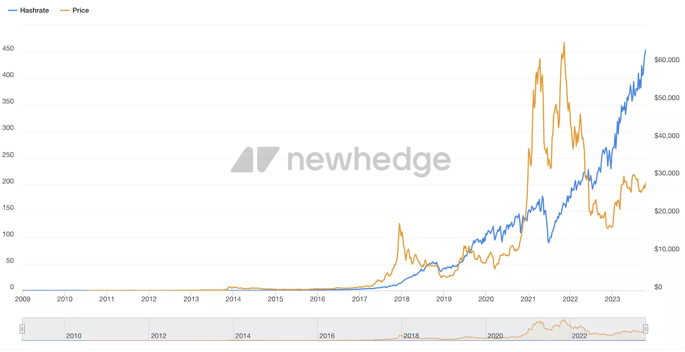

### Hash Rate og Belønning

Mining etablerer en bunnpris for Bitcoin, under hvilken gruvearbeidere ville selge med tap. Kostnaden ved gruvedrift påvirker prisen betydelig, som illustrert av forbudet mot gruvedrift i Kina, der hash-raten og prisen falt betydelig, men ble raskt gjenvunnet. Å fokusere utelukkende på prisen kan være misvisende. Å studere kostnaden, via lønnsomhetskalkulatorer, tilbyr et mer balansert perspektiv. Markedet kan imidlertid oppføre seg irrasjonelt, med gruvearbeidere som potensielt blir tvunget til å selge med tap, noe som potensielt kan senke prisen under gruvedriftskostnaden. For å vurdere helsen til Bitcoin og dets desentralisering, kunne en ligning som inkorporerer ulike faktorer, som antall noder og prisen, utvikles. Denne tilnærmingen kunne tilby en mer nyansert analyse av Bitcoin sammenlignet med diskusjoner basert utelukkende på pris.

### Gruvedrift for profitt eller for nettverket?

Spørsmålet er dyptgående og omfatter flere dimensjoner av Bitcoin-gruvedrift. Balansen mellom å søke profitt og bidra til sikkerheten og distribusjonen av Bitcoin-nettverket er et konstant dilemma for gruvearbeidere. Debatten fortsetter i Bitcoin-samfunnet, med sterke argumenter på hver side.

- Gruvedrift for profitt:

* For: Gruvearbeidere er naturlig tiltrukket av de potensielle inntektene fra Bitcoin-gruvedrift. Investering i dyrt gruveutstyr kan oppveies av gruvebelønninger og transaksjonsgebyrer, spesielt når prisen på Bitcoin er høy.
* Mot: Jakten på profitt kan føre til sentralisering av hash-kraft hvis bare noen få store selskaper har råd til å investere i avansert gruveutstyr. I tillegg kan gruvedrift for profitt ha en betydelig miljøpåvirkning.

- Gruvedrift for nettverket:

* For: Gruvedrift for å bidra til sikkerheten og desentraliseringen av Bitcoin-nettverket er et edelt initiativ. Det hjelper med å styrke nettverkets motstandsdyktighet og motstå sensur og angrep.
* Mot: Uten tilstrekkelig økonomisk insentiv kan det være vanskelig for gruvearbeidere å fortsette å støtte nettverket, spesielt hvis de opererer med tap.

Attakai-initiativet fremhever viktigheten av å bidra til nettverket samtidig som det tilbyr løsninger for å gjøre gruvedrift mer tilgjengelig og mindre skadelig. Muligheten for å drive gruvedrift hjemme, med rimeligere utstyr og løsninger for å redusere støyforurensning, kan bidra til å demokratisere Bitcoin-gruvedrift. Det oppmuntrer de som er interessert i Bitcoin til ikke bare å investere og holde på bitcoins, men også til å aktivt delta i å sikre nettverket. Ved å tilby testet utstyr og guider for montering og installasjon, gjør Attakai det lettere å entre verdenen av Bitcoin-gruvedrift. Det oppmuntrer også til innovasjon og kontinuerlige forbedringer, og inviterer samfunnet til å bidra og dele sine ideer og erfaringer for å forbedre hjemmegruvedrift. Attakai-modellen er et svar på spørsmålet om gruvedrift for profitt eller for nettverket. Det handler ikke bare om å tjene penger, men også om å styrke distribusjonen og sikkerheten til Bitcoin-nettverket, samtidig som det muliggjør for flere mennesker å delta i gruvedrift, lære og forstå denne avgjørende industrien. Utfordringen med et potensielt gruveforbud i Europa forblir et åpent spørsmål. Dette reiser bekymringer for fremtiden til Bitcoin-gruvedrift i regionen og behovet for balansert regulering som anerkjenner viktigheten av gruvedrift for sikkerheten og levedyktigheten til Bitcoin-nettverket, samtidig som det adresserer miljøspørsmål. Attakai og andre lignende initiativer kan spille en avgjørende rolle i denne debatten, ved å vise at det er mulig å drive gruvedrift på en mer bærekraftig og ansvarlig måte, samtidig som det bidrar positivt til Bitcoin-nettverket.

## Suverenitet og Regulering

<chapterId>9d9a5908-2acc-501e-906b-a6fce9ecfebd</chapterId>

### Suverenitet før profitt?

For å ta for oss det kritiske spørsmålet om rikdom gjennom gruvedrift, er det viktig å vurdere ulike perspektiver og tilnærminger. Spørsmål om lønnsomheten av gruvedrift er vanlige, med forespørsler rundt kjøp av aksjer i selskaper som Riot eller leasing av gruvedriftsmaskiner i land med lave energikostnader som Island eller Russland. Før man begir seg ut på gruvedrift, ville en nøkkelvurdering være å sammenligne lønnsomheten av gruvedrift med direkte kjøp av Bitcoin. Hvis kostnaden ved å utvinne en Bitcoin overstiger kostnaden ved å kjøpe den direkte, er det generelt klokere å kjøpe Bitcoin direkte. Dette unngår de mange utfordringene og kostnadene forbundet med gruveprosessen.

Likevel tilbyr gruvedrift unike måter å involvere seg i Bitcoin-økosystemet på. For eksempel kan gruvedrift av Bitcoin om vinteren være en smart måte å varme opp hjemmet ditt på mens du genererer Bitcoin-inntekter. En annen mulighet er å investere i selskaper som selger gruvedriftsutstyr og lagrer og håndterer maskinene på steder med lave energikostnader, noe som gir tilgang til gunstige strømpriser uten bryet med å håndtere utstyret.

Til tross for disse alternativene, presenterer gruvedrift betydelige utfordringer. Det velkjente ordtaket i kryptovalutaverdenen, "Ikke dine nøkler, ikke dine Bitcoins," finner en lignende gjenklang i gruvedriftsverdenen: "Ikke din hashrate, ikke din belønning." Historier om skuffelser og frakoblede maskiner er vanlige, med mange aktører som lover eksepsjonelle resultater, men mislykkes i å levere. Problemer med strømforsyning og maskinhavari kan etterlate investorer maktesløse, med dyrt utstyr de ikke kontrollerer. I denne konteksten er forsiktighet og en dyp forståelse av gruvesektoren avgjørende før man begir seg ut på det. Selv om det finnes muligheter for gevinster, er risikoene betydelige, og en informert og gjennomtenkt tilnærming er essensiell for å navigere i dette komplekse og ofte uforutsigbare feltet. Det er derfor avgjørende å gjennomføre grundig forskning og nøye vurdere fordeler og ulemper før man engasjerer seg i Bitcoin-gruvedrift.

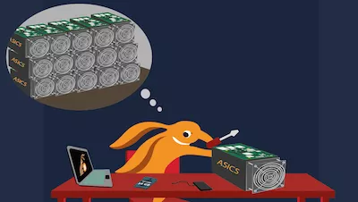

### Virgin Bitcoins

Ønsket om å eie sin egen hashrate fremstår som en lovende vei i gruvedriftsverdenen. Imidlertid krever navigering i dette komplekse økosystemet en forsiktig tilnærming. Feltet for skygruvedrift er preget av et stort antall svindler, drevet av en mangel på forståelse av gruvedrift fra mange investorer. Attraktive tilbud, pakket inn på ulike måter, kan lett villede de som ikke er tilstrekkelig informert. På den annen side tilbyr det å eie ditt eget gruvedriftsutstyr betydelige fordeler. I tillegg til den personlige tilfredsstillelsen av å aktivt bidra til sikkerheten til Bitcoin-nettverket og se belønninger falle inn i lommeboken din, er det tiltalende aspektet ved "virgin bitcoins." Dette er ferskt utvunne bitcoins, som aldri har blitt brukt og ikke har noen historie knyttet til dem. Disse bitcoinene anses ofte som mer verdifulle fordi de aldri har blitt "tattet," noe som tilbyr en viss garanti mot avvisning av regulatorer eller store handelsplattformer.

Muligheten for å utvinne virgin bitcoins samtidig som man unngår Know Your Customer (KYC)-prosedyrer er en annen merverdi. Mange gruvebassenger krever ikke identiteten til gruvearbeidere, noe som tillater anskaffelse av bitcoins uten å gjennomgå kjedelige identitetssjekker. Virgin bitcoins oppfattes som "rene," uten tidligere historie eller tilknytning. De er spesielt ettertraktet av store institusjonelle aktører som kan garantere legitimiteten til deres digitale eiendeler overfor regulatoriske myndigheter. Likevel, til tross for disse fordelene, er det avgjørende å anerkjenne at gruveindustrien forblir ekstremt konkurransedyktig og volatil, og uforutsette hendelser kan forstyrre gruveoperasjoner.

I denne konteksten virker det klokt å velge en autonom og opplyst tilnærming til gruvedrift. Å skaffe sin egen hashrate og investere i personlig gruvedriftsutstyr, samtidig som man er klar over risikoene og utfordringene, kan potensielt tilby en tryggere og mer tilfredsstillende vei til å skaffe virgin bitcoins, og dermed styrke den finansielle suvereniteten til individet samtidig som man støtter Bitcoin-økosystemet som helhet.

### Er gruvedrift forbudt i Europa?

Med spørsmålet om et potensielt forbud mot gruvedrift i Europa, blir diskusjoner om regulering stadig mer relevante. Det skiftende reguleringslandskapet kan faktisk ha en betydelig innflytelse på Bitcoin-gruvedriftsindustrien. Et forbud mot gruvedrift i Europa er et tenkelig scenario, spesielt med tanke på presedenser i Kina. Selv om gruvedriftsoperasjoner fortsetter i Kina til tross for forbudet, kan Europa følge en lignende vei. En bredere distribusjon av hashraten over forskjellige regioner kunne hjelpe med å styrke gruvesamfunnet i Europa, slik at de effektivt kan motvirke misforståelser og feiloppfatninger om gruvedrift, dens miljøpåvirkning og fotavtrykk på strømnettet.

Når man står overfor kampanjer som de fra Greenpeace og ofte villedende tall fra noen studier, forblir den beste våpenet sannferdig informasjon. Det er essensielt å informere allmennheten og beslutningstakere om virkeligheten av gruvedrift, dens kompleksitet og nyanser, i stedet for å la dem stole på stereotypier og unøyaktig informasjon. Jo mer informerte og bevisste folk er om hva gruvedrift virkelig er, jo bedre kan industrien forsvare seg mot potensielt restriktive reguleringer.

Konklusjonen er at til tross for den regulatoriske risikoen og muligheten for et gruvedriftsforbud i Europa, forblir det mest kraftfulle våpenet utdanning og informasjon. En klar og presis forståelse av gruvedrift, hvordan det fungerer, og dets påvirkning kan bidra til å avmystifisere industrien og bekjempe feilinformasjon, og dermed tilby bedre motstand mot potensielt skadelige reguleringer. Initiativet til å trene og informere folk om gruvedrift, som denne diskusjonen gjør, er et skritt i riktig retning for å sikre bærekraft og vekst for gruvedrift i Europa, og rundt om i verden. Kontinuerlige anstrengelser for å utdanne og informere er essensielle for å sikre en trygg og velstående fremtid for Bitcoin-gruvedriftsindustrien.

## Intervju med en profesjonell innen gruveindustrien

<chapterId>4d613261-d1a8-5ffe-a50c-047a3d77d6c5</chapterId>

### Bak kulissene i industriell gruvedrift - Sebastien Gouspillou

# Hjemmegruvedrift og gjenbruk av varme

<partId>78d22d06-2c4a-573f-86bb-1027115dad3a</partId>

## Attakai - gjør hjemmegruvedrift mulig og tilgjengelig!

<chapterId>1f5d1b74-2f99-5f31-a088-a73d36491ebf</chapterId>

Attakai, som betyr "den ideelle temperaturen" på japansk, er navnet på initiativet rettet mot å oppdage bitcoin-gruvedrift gjennom gjenbruk av varme lansert av @ajelexBTC og @jimzap21 med Découvre Bitcoin.
Denne ASIC-ombyggingsguiden vil tjene som grunnlag for å lære mer om gruvedrift, dens drift og den underliggende økonomien ved å demonstrere muligheten for å tilpasse en Bitcoin-gruvearbeider for bruk som radiatorer i hjem. Dette tilbyr mer komfort og besparelser, og lar deltakerne motta ikke-KYC BTC cashback på deres elektriske oppvarmingsregning.

Bitcoin justerer automatisk gruvedriftsvanskeligheten og belønner gruvearbeidere for deres deltakelse. Imidlertid kan konsentrasjonen av hashrate utgjøre risikoer for nettverkets nøytralitet. Å bruke Bitcoins databehandlingskraft for oppvarmingsløsninger gagner direkte nettverket selv ved å øke distribusjonen av databehandlingskraft.

### Hvorfor gjenbruke varmen fra en ASIC?

Det er viktig å forstå forholdet mellom energi og varmeproduksjon i et elektrisk system.
For en investering på 1 kW elektrisk energi, produserer en elektrisk radiator 1 kW varme, ikke mer, ikke mindre. Nye radiatorer er ikke mer effektive enn tradisjonelle radiatorer. Deres fordel ligger i deres evne til kontinuerlig og jevnt å distribuere varme i et rom, noe som gir mer komfort sammenlignet med tradisjonelle radiatorer som veksler mellom høy varmeeffekt og ingen oppvarming, og dermed skaper regelmessige temperaturvariasjoner og ubehag.
En datamaskin, eller mer generelt et elektronisk kort, forbruker ikke energi for å utføre beregninger, den trenger bare energi for å flyte gjennom komponentene for å fungere. Energiforbruket skyldes den elektriske motstanden i komponentene, som produserer tap og genererer varme, kjent som Joule-effekten.

Noen selskaper har kommet opp med ideen om å kombinere behovet for databehandlingskraft med oppvarmingsbehov gjennom radiator/servere. Ideen er å distribuere et selskaps servere i små enheter som kunne plasseres i hjem eller kontorer. Imidlertid står denne ideen overfor flere problemer. Behovet for servere er ikke relatert til behovet for oppvarming, og selskaper kan ikke bruke databehandlingskapasiteten til serverne sine fleksibelt. Det er også grenser for båndbredden som enkeltpersoner kan ha. Alle disse begrensningene hindrer selskapet i å gjøre disse kostbare installasjonene lønnsomme eller tilby en stabil online server-tjeneste uten datasentre som kan ta over når oppvarming ikke er nødvendig.

> Varmen som genereres av datamaskinen din er ikke bortkastet hvis du trenger å varme opp hjemmet ditt. Hvis du bruker elektrisk oppvarming der du bor, så er ikke varmen fra datamaskinen din bortkastet. Det koster det samme å generere denne varmen med datamaskinen din. Hvis du har et billigere oppvarmingssystem enn elektrisk oppvarming, så er bortkastelsen kun i kostnadsforskjellen. Hvis det er sommer og du bruker klimaanlegg, så er det dobbelt så bortkastet. Bitcoin-mining bør finne sted der det er billigere. Kanskje det vil være der klimaet er kaldt og hvor oppvarmingen er elektrisk, hvor mining vil bli gratis.
> Satoshi Nakamoto - 8. august 2010

Bitcoin og dens proof of work skiller seg ut fordi de automatisk justerer mining-vanskeligheten basert på mengden beregninger utført av hele nettverket. Denne mengden kalles hashrate og uttrykkes i hashes per sekund. I dag er den anslått til 380 exahashes per sekund, som er 380 milliarder milliarder hashes per sekund. Denne hashraten representerer arbeid og derfor en mengde energi brukt. Jo høyere hashrate, desto høyere vanskelighet, og omvendt. Således kan en Bitcoin-miner aktiveres eller deaktiveres når som helst uten å påvirke nettverket, i motsetning til radiator/servere som må forbli stabile for å tilby sin tjeneste. Mineren belønnes for sin deltakelse, relativt til andre, uansett hvor liten den kan være.

Oppsummert produserer både en elektrisk radiator og en Bitcoin-miner 1 kW varme for 1 kW elektrisitet forbrukt. Men, mineren mottar også bitcoins som belønning. Uavhengig av prisen på elektrisitet, prisen på bitcoin, eller konkurransen i Bitcoin-miningaktivitet på nettverket, er det økonomisk mer fordelaktig å varme opp med en miner enn med en elektrisk radiator.

### Den tilføyde verdien for Bitcoin

Det som er viktig å forstå, er hvordan mining bidrar til desentraliseringen av Bitcoin.
Flere eksisterende teknologier har blitt genialt kombinert for å bringe Nakamotos konsensus til liv. Denne konsensusen økonomisk belønner ærlige deltakere for deres bidrag til driften av Bitcoin-nettverket, samtidig som den avskrekker uærlige deltakere. Dette er et av nøkkelpunktene som lar nettverket eksistere bærekraftig.
Ærlige aktører, de som miner i henhold til reglene, konkurrerer alle med hverandre for å oppnå den største mulige andelen av belønningen for å produsere nye blokker. Denne økonomiske insentiven fører naturlig til en form for sentralisering ettersom selskaper velger å spesialisere seg på denne lukrative aktiviteten ved å redusere kostnadene gjennom stordriftsfordeler. Disse industrielle aktørene har en fordelaktig posisjon for å kjøpe og vedlikeholde maskiner, samt forhandle om engrospriser på elektrisitet.

> I begynnelsen ville de fleste brukere kjøre nettverksnoder, men etter hvert som nettverket vokser utover et visst punkt, ville det bli overlatt mer og mer til spesialister med serverfarmer av spesialisert maskinvare. En serverfarm ville bare trenge å ha en node på nettverket, og resten av LAN kobler seg til den noden.
> Satoshi Nakamoto - 2. november 2008

Visse enheter holder en betydelig prosentandel av den totale hashraten i store miningfarmer. Vi kan observere den nylige kuldebølgen i USA hvor en betydelig del av hashraten ble tatt offline for å omdirigere energi til husholdninger med et eksepsjonelt behov for elektrisitet. I flere dager ble minerne økonomisk incentivert til å stenge ned farmene sine, og dette eksepsjonelle været kan sees på Bitcoin hashrate-kurven.

Dette problemet kan bli problematisk og utgjør en betydelig risiko for nettverkets nøytralitet. En aktør med mer enn 51% av hashraten kunne lettere sensurere transaksjoner om de ønsket. Derfor er det viktig å distribuere hashraten blant flere aktører i stedet for sentraliserte enheter som kunne bli lettere beslaglagt av en regjering, for eksempel.

**Hvis minerne er distribuert i tusenvis, eller til og med millioner, av husholdninger rundt om i verden, blir det veldig vanskelig for en stat å ta kontroll over dem.**

Når den kommer ut av fabrikken, er en miner ikke egnet til bruk som en varmeovn i et hjem, på grunn av to hovedproblemer: overdreven støy og mangel på justering. Imidlertid kan disse problemene enkelt løses gjennom maskinvare- og programvaremodifikasjoner, noe som tillater en mye stillere miner som kan konfigureres og automatiseres som moderne elektriske varmeovner.

**Attakaï er et pedagogisk initiativ som lærer deg hvordan du kan oppgradere Antminer S9 på den mest kostnadseffektive måten.**

Dette er en utmerket mulighet til å lære ved å praktisere samtidig som du blir belønnet for din deltakelse med KYC-frie satoshis.

## Kjøpsguide for en Brukt ASIC

<chapterId>3b0b3bf0-859b-57f2-b92f-843ac70b7e68</chapterId>

I denne delen vil vi diskutere beste praksiser for å kjøpe en brukt Bitmain Antminer S9, maskinen som denne radiatormodifiseringstutorialen vil være basert på. Denne guiden gjelder også for andre modeller av ASICs ettersom det er en generell kjøpsguide for brukt miningmaskinvare.

Antminer S9 er en enhet som tilbys av Bitmain siden mai 2016. Den forbruker 1400W med elektrisitet og produserer 13,5 TH/s. Selv om den anses som gammel, forblir den et utmerket alternativ for å starte mining. Siden den har blitt produsert i store mengder, er det enkelt å finne reservedeler rikelig i mange regioner av verden. Den kan generelt kjøpes peer-to-peer på nettsteder som eBay eller LeBonCoin, ettersom profesjonelle forhandlere ikke lenger tilbyr den på grunn av dens lavere konkurranseevne sammenlignet med nyere maskiner. Den er mindre effektiv enn ASICs som Antminer S19, som har vært tilbudt siden mars 2020, men dette gjør den til en rimelig brukt maskinvare og mer egnet for modifikasjonene vi vil gjøre.

Antminer S9 kommer i flere varianter (i, j) som gjør mindre modifikasjoner til maskinvaren av første generasjon. Vi tror ikke at dette bør påvirke kjøpsbeslutningen din, og denne guiden fungerer for alle disse variantene.
Prisen på ASICs varierer avhengig av mange faktorer som prisen på bitcoin, nettverksvanskeligheter, maskineffektivitet og strømkostnad. Derfor er det vanskelig å gi et nøyaktig estimat for kjøp av en brukt maskin. I februar 2023 varierer den forventede prisen i Frankrike generelt fra €100 til €200, men disse prisene kan endre seg raskt.

Antminer S9 består av følgende deler:

- 3 hashboards som inneholder brikkene som produserer hashkraften.

- Et kontrollkort som inkluderer en spor for et SD-kort, en Ethernet-port og kontakter for hashboards og vifter. Dette er hjernen i din ASIC.

- 3 datakabler som kobler hashboards til kontrollkortet.

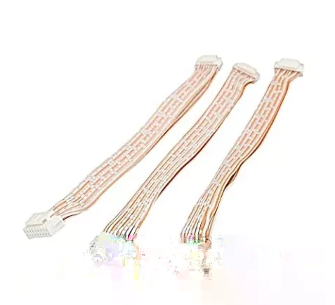

- Strømforsyningen, som opererer på 220V og kan plugges inn som en vanlig husholdningsapparat.

- 2 120mm vifter.

- En hann C13-kabel.

Når du kjøper en brukt maskin, er det viktig å sjekke at alle deler er inkludert og fungerer. Under utvekslingen bør du be selgeren om å slå på maskinen for å sjekke at den fungerer som den skal. Det er viktig å verifisere at enheten slår seg på korrekt, og deretter sjekke internettforbindelsen ved å koble til en Ethernet-kabel og få tilgang til Bitmain login-grensesnittet via en nettleser på samme lokale nettverk. Du kan finne denne IP-adressen ved å koble til grensesnittet på din internett-router og se etter tilkoblede enheter. Denne adressen bør ha følgende format: 192.168.x.x

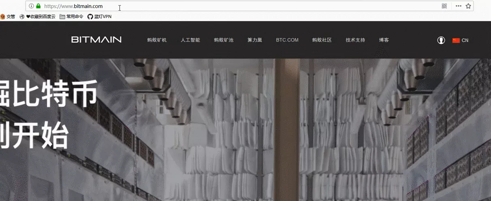

Sjekk også at standard påloggingsinformasjon fungerer (brukernavn: root, passord: root). Hvis standard påloggingsinformasjon ikke fungerer, må du tilbakestille maskinen.

Når du er tilkoblet, bør du kunne se statusen for hvert hashboard på dashbordet. Hvis miner er koblet til en pool, bør du se at alle hashboards fungerer. Det er viktig å merke seg at minere lager mye støy, noe som er normalt. Sørg også for at viftene fungerer som de skal.

Du kan deretter fjerne den forrige eierens mining pool for å sette opp din egen senere. Hvis du ønsker, kan du også inspisere hashboards ved å demontere maskinen. Dette trinnet er imidlertid mer komplekst og krever mer tid og noen verktøy. Hvis du ønsker å fortsette med denne demonteringen, kan du referere til neste del av denne veiledningen som detaljerer hvordan du gjør det. Det er viktig å merke seg at minere samler mye støv og krever regelmessig vedlikehold. Du kan observere denne støvakkumuleringen og vedlikeholdskvaliteten ved å demontere maskinen.
Etter å ha gjennomgått alle disse punktene, kan du kjøpe maskinen din med høy grad av tillit. Hvis du er i tvil, konsulter fellesskapet.

For å oppsummere denne veiledningen i én setning: **"Ikke stol, verifiser."**
[Du kan også henvende deg til profesjonelle innen rekonstruksjon av gruveutstyr, som vår partner 21energy. De tilbyr testede S9-maskiner, rengjort og med BraiiinOS+ programvare allerede installert. Med affiliatekoden "decouvre" vil du motta en 10% rabatt på kjøpet av en S9 samtidig som du støtter Attakai-prosjektet.](https://21energy.io/en/produkt/bitmain-antminer-s9-bundle/)

## Guide for kjøp av maskinvaremodifikasjoner for S9

<chapterId>fa5f5eca-bcbf-5a83-9b03-98ecbadbabd6</chapterId>

Som eier av en Antminer S9, vet du sannsynligvis hvor høylytt og klumpete dette utstyret kan være. Det er imidlertid mulig å transformere det til en stille og tilkoblet varmeovn ved å følge noen enkle trinn. I denne seksjonen vil vi presentere det nødvendige utstyret for å gjøre modifikasjonene.

Hvis du er en dyktig håndverker og ser etter å transformere en miner til en varmeovn, er denne veiledningen for deg. Vi ønsker å advare deg om at modifikasjoner gjort på en elektronisk enhet kan presentere elektriske risikoer. Det er derfor essensielt å ta alle nødvendige forholdsregler for å unngå skade eller skader.

1. Bytt ut viftene

De originale viftene til Antminer S9 er for støyende til å bruke din Antminer som en varmeovn. Løsningen er å erstatte dem med stillere vifter. Vårt team har testet flere modeller fra Noctua-merket og har valgt Noctua NF-A14 iPPC-2000 PWM som det beste kompromisset. Sørg for å velge 12V-versjonen av viftene. Denne 140mm viften kan produsere opptil 1200W med varme samtidig som den opprettholder et teoretisk støynivå på 31 dB. For å installere disse 140mm viftene, trenger du å bruke en 140mm til 120mm adapter, som du kan finne i DécouvreBitcoin-butikken. Vi vil også legge til 140mm beskyttelsesgriller.

Strømforsyningsviften er også ganske støyende og trenger å bli erstattet. Vi anbefaler Noctua NF-A6x25 PWM. Merk at koblingene til Noctua-viftene ikke er de samme som de originale, så du trenger en koblingsadapter for å koble dem til. To vil være nok. Igjen, sørg for å velge 12V-versjonen av viften.

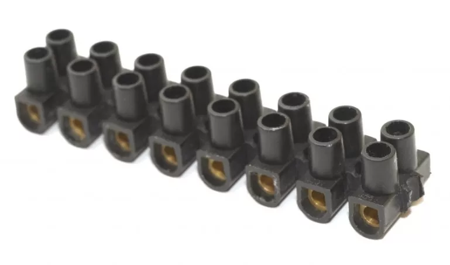

2. Legg til en WIFI/Ethernet-bro

I stedet for å bruke en Ethernet-kabel, kan du koble din Antminer via WIFI ved å legge til en WIFI/Ethernet-bro. Vi har valgt vonets vap11g-300 fordi den enkelt lar deg hente WIFI-signalet fra din Internett-boks og overføre det til din Antminer via Ethernet uten å opprette et subnett. Hvis du har elektriske ferdigheter, kan du strømforsyne den direkte med Antminerens strømforsyning uten behov for å legge til en USB-lader. For dette, trenger du en kvinnelig 5.5mmx2.1mm jack.

3. Valgfritt: legg til en smart plugg
   Hvis du ønsker å slå på/av din Antminer fra smarttelefonen din og overvåke strømforbruket, kan du legge til en smartplugg. Vi testet ANTELA-pluggen i 16A-versjonen, kompatibel med smartlife-appen. Denne smartpluggen lar deg se daglig og månedlig strømforbruk og kobler seg direkte til internett-ruteren din via WiFi.
   

Liste over utstyr og lenker

- 2X 3D-adapterstykke 140mm til 120mm

- [2X NF-A14 iPPC-2000 PWM](https://www.amazon.fr/Noctua-nf-polarized-A14-industrialppc-PWM-2000/dp/B00KESSUDW/ref=sr_1_2?__mk_fr_FR=ÅMÅŽÕÑ&crid=JCNLC31F3ECM&keywords=NF-A14+iPPC-2000+PWM&qid=1676819936&sprefix=nf-a14+ippc-2000+pwm%2Caps%2C114&sr=8-2)

- [2X 140mm viftegriller](https://www.amazon.fr/dp/B06XD4FTSQ?psc=1&ref=ppx_yo2ov_dt_b_product_details)
- [Noctua NF-A6x25 PWM](https://www.amazon.fr/Noctua-nf-a6-25-PWM-Ventilateur-Marron/dp/B00VXTANZ4/ref=sr_1_1_sspa?__mk_fr_FR=ÅMÅŽÕÑ&crid=3T313ABZA5EDE&keywords=Noctua+NF-A6x25+PWM&qid=1676819329&sprefix=noctua+nf-a6x25+pwm%2Caps%2C71&sr=8-1-spons&sp_csd=d2lkZ2V0TmFtZT1zcF9hdGY&psc=1&smid=A38F5RZ72I2JQ)

- [Elektrikerens sukker 2.5mm2](https://www.amazon.fr/Legrand-LEG98433-Borne-raccordement-Nylbloc/dp/B00BBHXLYS/ref=sr_1_3?__mk_fr_FR=ÅMÅŽÕÑ&crid=25IRJD7A0YN2A&keywords=sucre%2Belectrique%2B2mm2&qid=1676820815&sprefix=sucre%2Belectrique%2B2mm2%2Caps%2C84&sr=8-3&th=1)
- [Vonets vap11g-300](https://www.amazon.fr/Vonets-VAP11G-300-Bridge-convertit-Ethernet/dp/B014SK2H6W/ref=sr_1_3_sspa?__mk_fr_FR=ÅMÅŽÕÑ&crid=13Q33UHRKCKG5&keywords=vonet&qid=1676819146&s=electronics&sprefix=vonet%2Celectronics%2C98&sr=1-3-spons&sp_csd=d2lkZ2V0TmFtZT1zcF9hdGY&psc=1)
- [Valgfri ANTELA smart plugg](https://www.amazon.fr/dp/B09YYMVXJZ/ref=twister_B0B5X46QLW?_encoding=UTF8&psc=1)

# Attakai - Modifisering av programvaren til en Antminer S9

<partId>afc9c29a-84aa-5f1d-82e2-5fd9ff2e1805</partId>

## Sette opp en Vonet WIFI/Ethernet-bro

<chapterId>3cf487a4-21ef-5b24-83d5-789b811f740f</chapterId>

For å koble din ASIC via WIFI, trenger du en enhet kalt en bro. Denne enheten lar deg motta WIFI-signalet fra ruteren din og overføre det til en annen enhet via Ethernet.

Mange enheter kan utføre denne funksjonen, men vi anbefaler VONETS WiFi Bridge/Repeater for dens bekvemmelighet.

Strømforsyning til broen ved å koble den til via USB.

Fra datamaskinen din, koble til VONETS\_**\*\*** WIFI-nettverket med passordet 12345678.

Logg inn med brukernavnet "admin" og passordet "admin".

Velg Veiviser.

Velg WIFI-nettverket du vil koble din miner til, og klikk deretter Neste.

MERK: Vonet-broen fungerer kun på 2.4GHz-frekvensen. I dag tilbyr rutere vanligvis to WIFI-nettverk, ett på 2.4GHz og ett på 5GHz.

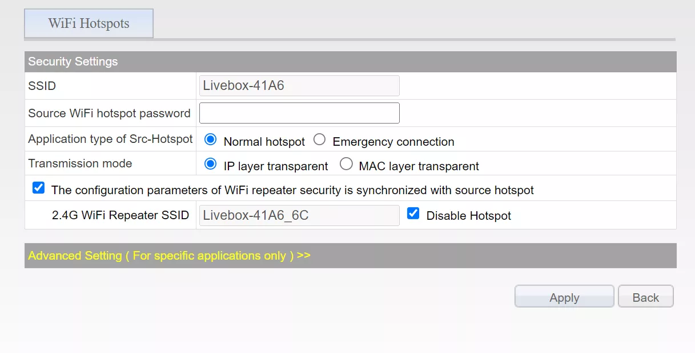

Skriv inn passordet for ditt WIFI-nettverk i feltet "Source WIFI hotspot password". Hvis du ikke ønsker å bruke din Vonet-bro for å utvide ditt WIFI-nettverk, merk av i boksen "Disable Hotspot". Ellers, la den være umarkert.

Du kan deretter klikke på Apply.

Til slutt, klikk på reboot for å starte broen på nytt. Det vil ta noen minutter å starte på nytt.

Broen skal koble seg til ruteren din og vises under navnet "[VONETS.COM](http://vonets.com/)". Hvis den fortsatt ikke kobler seg til etter noen minutter, kan det hende du må koble fra/koble til broen på nytt.

Når broen er koblet til, koble Ethernet-kabelen fra broen til din ASIC, og deretter koble ASICen til strømuttaket. Du kan da få tilgang til ASIC-grensesnittet på samme måte som om den var direkte koblet til ruteren din via Ethernet.

## Tilbakestille en Antminer S9

<chapterId>b518b6bd-9dae-5136-ae3c-1fafb1cb2592</chapterId>

Før du installerer BraiinOS+, kan det være nødvendig å tilbakestille din S9 til fabrikkinnstillingene.
Denne metoden kan anvendes mellom 2 minutter og 10 minutter etter at mineren er startet.
2 minutter etter at mineren er slått på, vennligst trykk på "Reset"-knappen i 5 sekunder, og slipp den deretter. Mineren vil bli gjenopprettet til fabrikkinnstillingene innen 4 minutter og vil starte på nytt automatisk (det er ikke nødvendig å slå den av).

## Installere BraiinsOS+ på en Antminer S9

<chapterId>38e8b1a8-8b1d-51ed-8b92-59d4ddb15184</chapterId>
Den opprinnelige programvaren installert av Antminer på deres gruvearbeidermaskiner er begrenset i funksjonalitet. Derfor vil vi i denne veiledningen installere en annen programvare kalt BraiinsOS+. Det er en tredjeparts programvare utviklet av det aller første Bitcoin gruvebassenget som har flere funksjoner og tillater, for eksempel, å endre maskinens kraft.

Det er flere måter å installere Braiins OS+ på en ASIC. Du kan henvise til denne veiledningen så vel som den [offisielle Braiins-dokumentasjonen](https://academy.braiins.com/en/braiins-os/about/).

Her vil vi se hvordan man enkelt installerer Braiins OS+ direkte på minnet til din Antminer ved hjelp av BOS toolbox-programvaren, og erstatter det opprinnelige operativsystemet, gjennom de detaljerte trinnene nedenfor.

1. Slå på din Antminer og koble den til din internettboks.
2. Last ned BOS toolbox for Windows / Linux.
3. Pakk ut den nedlastede filen og åpne bos-toolbox.bat-filen. Velg språk, og etter noen øyeblikk, vil du se dette vinduet:

4. Bos toolbox vil tillate deg å enkelt finne IP-adressen til din Antminer og installere BraiinsOS+. Hvis du allerede kjenner IP-adressen til maskinen din, kan du hoppe over til trinn 8. Ellers, gå til skannefanen.

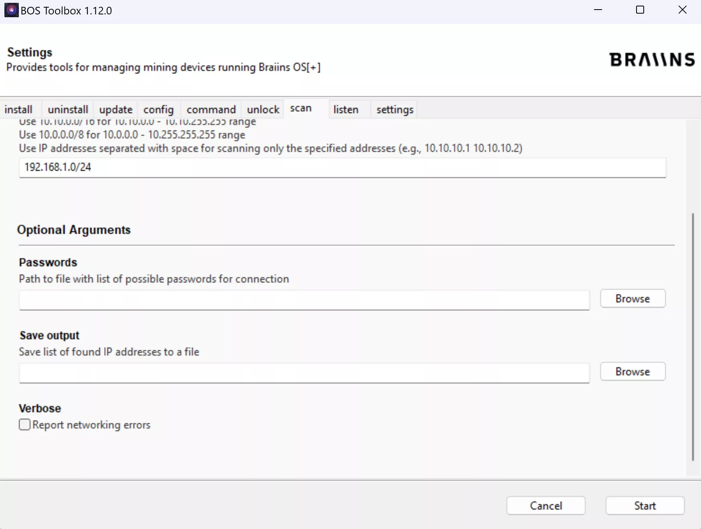

5. Vanligvis, på hjemmenettverk, er IP-adresseområdet mellom 192.168.1.1 og 192.168.1.255, så skriv inn "192.168.1.0/24" i IP-områdefeltet. Hvis nettverket ditt er annerledes, vennligst endre disse adressene tilsvarende. Deretter klikker du på "Start".

6. Oppmerksomhet, hvis Antmineren har et passord, vil ikke deteksjonen fungere. Hvis det er tilfellet, er den enkleste løsningen å utføre en tilbakestilling.

7. Du bør se alle Antminerene på nettverket ditt dukke opp her, og IP-adressen er 192.168.1.37.

8. Klikk på "Tilbake" og deretter "Installer"-fanen, skriv inn den tidligere funnete IP-adressen, og klikk på "Start".

> Hvis installasjonen ikke fungerer, kan det være nødvendig å utføre en tilbakestilling og prøve igjen (se forrige seksjon).

9. Etter noen øyeblikk vil din Antminer starte på nytt og du vil kunne få tilgang til Braiins OS+-grensesnittet på den angitte IP-adressen, her 192.168.1.37, direkte i adressefeltet til nettleseren din. Standard brukernavn er "root" og det er ikke noe standard passord.

## Konfigurer BraiinsOS+

<chapterId>36e432f2-85bc-52d0-a62a-009fc4c69338</chapterId>

Du må koble til din ASIC ved hjelp av den lokale IP-adressen til enheten din på nettverket ditt gjennom en nettleser.

Du kan finne IP-adressen til maskinen din ved hjelp av BOS toolbox-verktøyet eller direkte på din ruters nettside.

Standard påloggingsinformasjon er den samme som det opprinnelige operativsystemet.

- brukernavn: root
- passord: (ingen)

Du vil da bli møtt av Brains OS+-dashbordet.

### Dashbord

På denne første siden kan du observere maskinens sanntidsytelse.

- Tre sanntidsgrafer som viser temperaturen, hashraten og den generelle statusen til maskinen din.
- På høyre side, den reelle hashraten, gjennomsnittlig chip-temperatur, estimert effektivitet i W/THs, og strømforbruk.
- Nedenfor, viftehastigheten som en prosentandel av maksimal hastighet og antall rotasjoner per minutt.
  

- Lenger ned, vil du finne en detaljert visning av hvert hashbord. Gjennomsnittstemperaturen på brettet og brikkene det inneholder, samt spenningen og frekvensen.
- Detaljer om de aktive gruvebassengene i Pools.
- Statusen for autotuning i Tuner Status.
- På høyre side, detaljer om dataene som overføres til bassenget.

### Konfigurasjon

### System

### Hurtigaksjoner

# Attakai - Modifikasjon av vifte

<partId>98266a8f-3745-58a0-9f6b-26a9734e1427</partId>

## Bytt strømforsyningsviften

<chapterId>0c6befa7-f3ef-5bcf-ae8d-0ad5e5d41d70</chapterId>

> ADVARSEL: Det er essensielt å ha installert Braiins OS+ på din miner, eller annen programvare som kan redusere maskinens ytelse, på forhånd. Dette tiltaket er kritisk fordi for å redusere støy, vil vi installere mindre kraftige vifter som kan avlede mindre varme.

### Nødvendige materialer

- 1 Noctua NF-A6x25 PWM vifte
- 2.5mm2 elektrikerens sukker

> ADVARSEL: Først og fremst, før du starter, sørg for at du har trukket ut støpselet til din miner for å unngå enhver risiko for elektrisk støt.

Først, fjern de 6 skruene på siden av kabinettet som holder det lukket. Når skruene er fjernet, åpne forsiktig kabinettet for å fjerne plastbeskyttelsen som dekker komponentene.

Deretter er det på tide å fjerne den originale viften, og ta vare på å ikke skade de andre komponentene. For å gjøre dette, fjern skruene som holder den på plass og forsiktig skrell av den hvite limen rundt kontakten. Det er viktig å fortsette med forsiktighet for å unngå å skade ledningene eller kontaktene.

Når den originale viften er fjernet, vil du legge merke til at kontaktene til den nye Noctua-viften ikke passer med de originale viftekontaktene. Faktisk har den nye viften 3 ledninger, inkludert en gul ledning som tillater hastighetskontroll. Imidlertid vil ikke denne ledningen bli brukt i dette spesifikke tilfellet. For å koble til den nye viften, anbefales det derfor å bruke en spesiell adapter. Det er imidlertid viktig å merke seg at denne adapteren noen ganger kan være vanskelig å finne.

Hvis du ikke har denne adapteren, kan du fortsatt fortsette å koble til den nye viften ved å bruke elektrikerens sukker. For å gjøre dette, må du kutte kablene til den gamle og den nye viften.

På den nye viften, bruk en kutter og skjær forsiktig konturene av hovedkappen på 1cm uten å kutte kappene til kablene under.

Deretter, ved å trekke hovedkappen nedover, kutt kappene til de røde og svarte kablene på samme måte som før. Og kutt den gule kabelen flush.

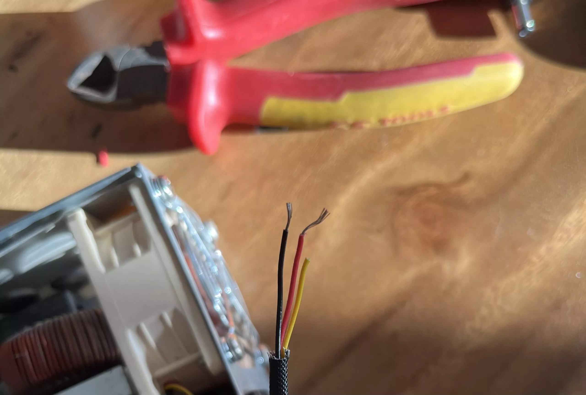
På den gamle viften er det mer delikat å kutte hovedkappen uten å skade kappene til de røde og svarte ledningene. For dette brukte vi en nål som vi skled mellom hovedkappen og de røde og svarte ledningene.
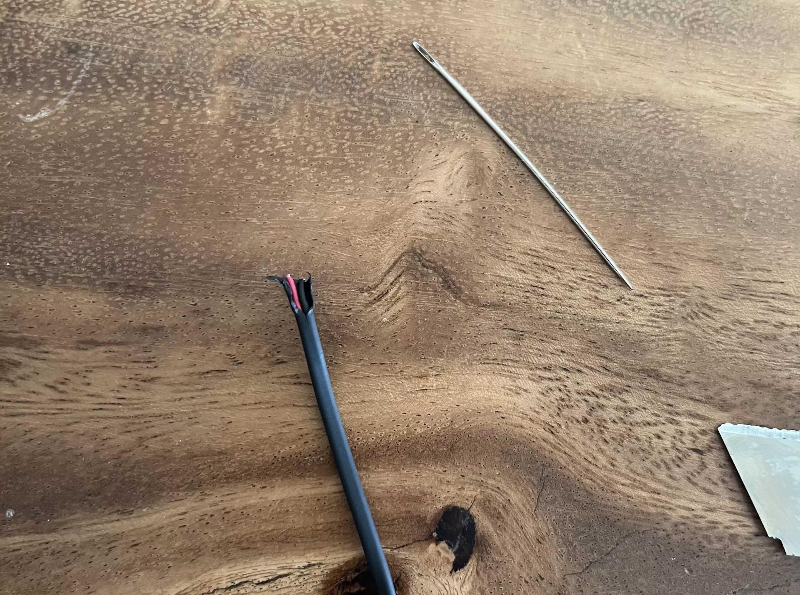

Når de røde og svarte ledningene er eksponert, kutt kappene forsiktig for å unngå å skade de elektriske ledningene.

Deretter kobler du kablene med en sukkerbit, den svarte ledningen med den svarte og den røde ledningen med den røde. Du kan også legge til elektrisk tape.

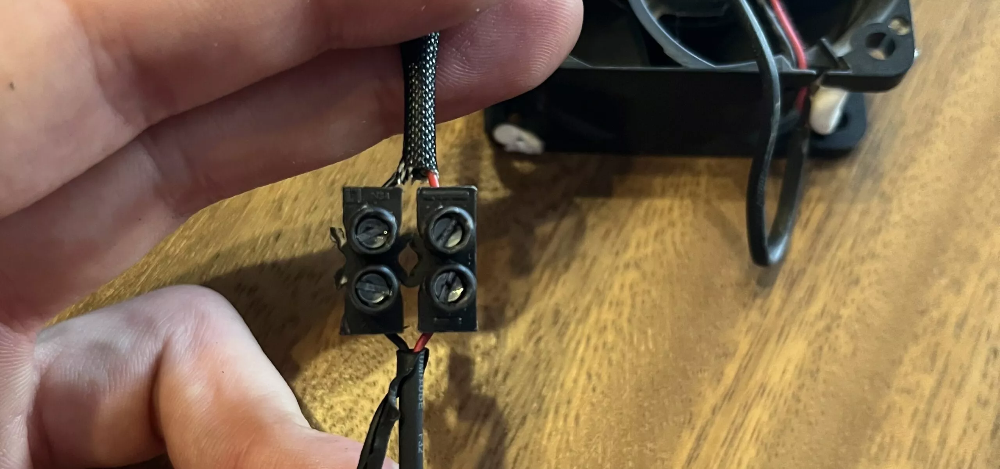

Når tilkoblingen er gjort, er det på tide å installere den nye Noctua-viften med grillen og de gamle skruene. De nye skruene i esken vil bli gjenbrukt senere. Sørg for å plassere den i riktig orientering. Du vil legge merke til en pil på den ene siden av viften, som indikerer luftstrømmens retning. Det er viktig å posisjonere viften slik at denne pilen peker mot innsiden av kabinettet. Deretter kobler du til viften på nytt.

> Valgfritt: Hvis du har kunnskap om elektrisitet, kan du direkte legge til en kvinnelig 5,5 mm jack-kontakt til 12V strømutgangen, som vil drive Vonet Wi-Fi-broen direkte. Hvis du derimot er usikker på dine elektriske ferdigheter, er det best å bruke USB-kontakten med en lader av smarttelefontype for å unngå risiko for kortslutning eller elektrisk skade.

Når tilkoblingene er gjort, plasser plastdekselet over kabinettplasten og ikke inni.

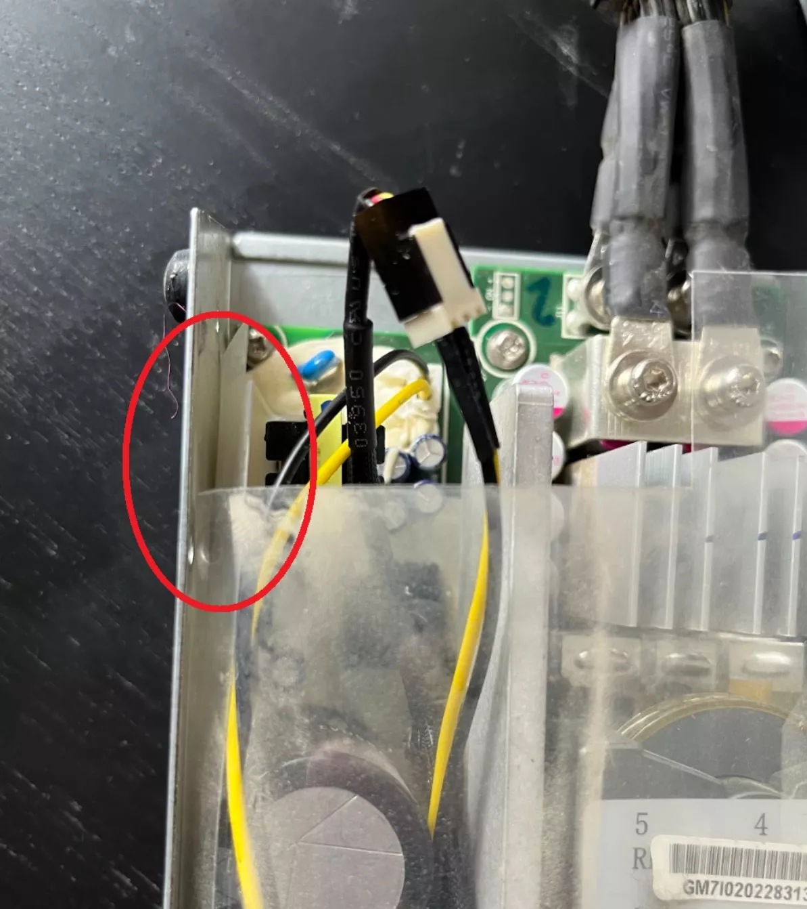

Til slutt, sett kabinettdekselet tilbake på plass og skru de 6 skruene på sidene for å holde alt på plass. Og der har du det, strømforsyningskabinettet ditt er nå utstyrt med en ny vifte.

## Å erstatte hovedviftene

<chapterId>a29f60f1-3fa3-57fc-a630-9c97cec30e56</chapterId>

> ADVARSEL: Det er avgjørende å ha installert Braiins OS+ på din miner, eller annen programvare som er i stand til å redusere ytelsen til maskinen din. Dette tiltaket er avgjørende fordi vi for å redusere støy vil installere mindre kraftige vifter, som vil spre mindre varme.

### Nødvendige materialer

- 2 stykker 3D-adapter 140mm til 120mm
- 2 Noctua NF-A14 iPPC-2000 PWM-vifter
- 2 140mm viftegriller

> ADVARSEL: Først og fremst, før du starter, sørg for å koble fra mineren din for å unngå risiko for elektrisk støt.

1. Først, koble fra viftene og skru dem ut.

2. Kontaktene til de nye Noctua-viftene passer ikke til de originale, men ikke bekymre deg! Ta frem din kutter og kutt forsiktig de små plasttappene slik at kontaktene passer perfekt på mineren din.

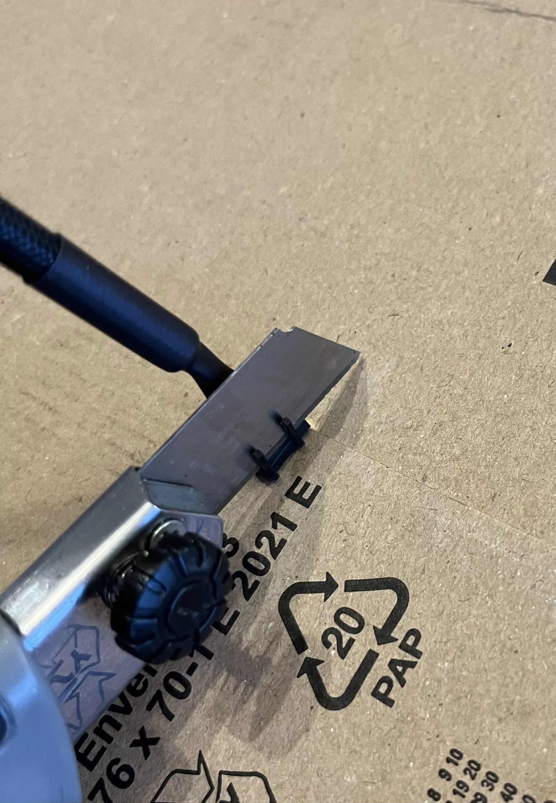 3. Det er på tide å installere 3D-delene!
Fest dem på begge sider av miner ved å bruke skruene du fjernet fra viftene. Skru dem inn til skruehodet er i flukt med 3D-delen og den sitter sikkert på plass. Vær forsiktig så du ikke strammer for mye, da du kan deformere delen og en av skruene kan komme i kontakt med en kondensator!

4. Nå går vi videre til viftene.

Fest dem til 3D-delene med skruene som fulgte med i esken. Vær oppmerksom på luftstrømmens retning, pilene på sidene av viftene vil indikere hvilken retning du skal følge. Gå fra Ethernet-port-siden til den andre siden. Se bildet nedenfor.

5. Siste steg: koble til viftene og fest grillene på toppen med skruene som ikke ble brukt i strømforsyningsvifte-esken. Du har bare 4 av dem, men 2 per grill i motsatte hjørner vil være nok. Du kan også se etter lignende skruer i en jernvarehandel om nødvendig.

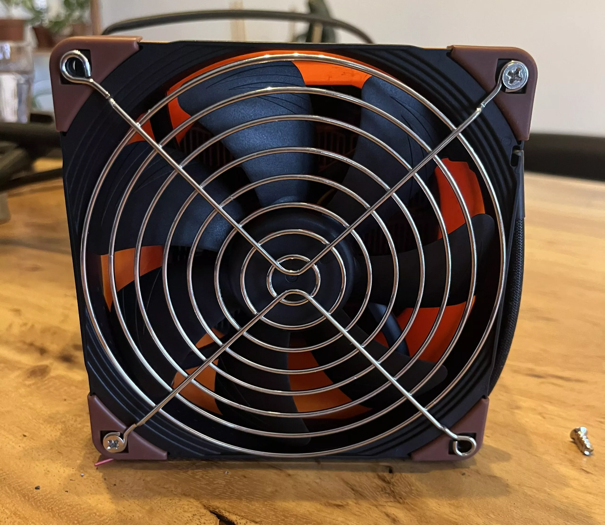

Mens du venter på å kunne tilby et mer stilig kabinett for din nye varmeovn, kan du feste kabinettet og strømforsyningen med elektrikerstrips.

Og for den siste finishen, koble til Vonet-broen til Ethernet-porten og dens strømforsyning.

Og der har du det, gratulerer! Du har nettopp erstattet hele den mekaniske delen av din miner. Du bør nå høre mye mindre støy.

# Attakai - Konfigurasjon

<partId>9c3918a8-d9a3-5a1f-bb9a-70314f7ac175</partId>

## Bli med i en miningpool

<chapterId>b57a6105-0a53-5fe9-bad1-d6d9daf97c0d</chapterId>

Man kan tenke på en miningpool som et landbrukssamvirke. Bønder samler sin produksjon sammen for å redusere variansen i tilbud og etterspørsel og dermed oppnå mer stabil inntekt for sin drift. En miningpool fungerer på samme måte, med den delte ressursen værende hashes. Faktisk, oppdagelsen av en enkelt gyldig hash tillater skapelsen av en blokk og vinningen av coinbase eller belønningen, for øyeblikket 6.25 BTC pluss transaksjonsgebyrene inkludert i blokken.

Hvis du miner alene, vil du kun bli belønnet når du finner en blokk. Ved å være i konkurranse mot alle andre minere på planeten, ville du ha veldig liten sjanse for å vinne dette lotteriet og du måtte fortsatt betale gebyrene forbundet med å bruke din miner uten noen garanti for suksess. Miningpools adresserer dette problemet ved å samle databehandlingskraften til flere (tusenvis) av minere og dele deres belønninger basert på prosentandelen av deltakelse i poolens hashrate når en blokk blir funnet. For å visualisere dine sjanser for å mine en blokk alene, kan du bruke dette verktøyet. Ved å angi informasjonen for en Antminer S9, kan vi se at sjansene for å finne en hash som tillater skapelsen av en blokk er 1 i 24,777,849 for hver blokk eller 1 i 172,068 per dag. I gjennomsnitt (med en konstant hashrate og vanskelighetsgrad), ville det ta 471 år å finne en blokk.
Selv om alt i Bitcoin er basert på sannsynlighet, skjer det noen ganger at solo-minere blir belønnet for å ta denne risikoen: Solo Bitcoin Miner Løser Blokk Med Hash Rate på Bare 10 TH/s, Slår Ekstremt Usannsynlige Odds – Decrypt
Hvis du liker å gamble, kan du prøve det, men vår guide vil ikke fokusere i den retningen. I stedet vil vi konsentrere oss om miningpoolen som best passer våre behov for å skape et oppvarmingssystem.

Vurderinger å ha når du velger en miningpool er driften av poolens belønningssystem, som kan variere, samt det minste beløpet før man kan ta ut belønninger til en adresse. For eksempel, Braiins, som tilbyr programvaren vi diskuterer her, tilbyr også en pool. Denne poolen har et belønningssystem kalt "Score" som oppmuntrer minere til å mine over lange perioder. Deltakelse inkluderer en oppetidsfaktor uttrykt som en "scoring hashrate". I vårt tilfelle, hvor vi ønsker et oppvarmingssystem som kan slås på bare noen få minutter, er dette ikke det ideelle belønningssystemet. Vi foretrekker et belønningssystem som gir oss lik belønning for hver deltakelse. I tillegg er det minste uttaksbeløpet for Braiins Pool 100 000 sats og On-Chain. Så vi taper noen sats i transaksjonsgebyrer og en del av vår belønning kan bli låst hvis vi ikke miner nok i løpet av vinteren.

Belønningsmodellen som interesserer oss er PPS, som står for "pay-per-share". Dette betyr at mineren vil motta en belønning for hver gyldig andel. Det finnes også en variant av dette systemet, FPPS (Full Pay Per Share), som ikke bare deler coinbase-belønningen, men også transaksjonsgebyrene inkludert i blokken. Miningpoolene vi anbefaler for å koble til din mining/oppvarming er Linecoin Pool (FPPS) og Nicehash (PPS).

- Nicehash: Fordelen med Nicehash er at uttak kan gjøres ved hjelp av Lightning med minimale gebyrer. I tillegg er det minste uttaksbeløpet 2000 sats. Ulempen er at Nicehash bruker sin hashrate for den mest lønnsomme blockchain, uten å virkelig gi kontroll til brukeren, så det kan ikke nødvendigvis bidra til Bitcoin hashrate.

- Linecoin: Fordelen med Linecoin er antall funksjoner som tilbys, som et detaljert dashboard, muligheten til å gjøre uttak med en Paynym (BIP 47) for bedre personvernbeskyttelse, og integrasjonen av en Telegram-bot samt direkte konfigurerbare automatiseringer i mobilapplikasjonen. Denne poolen miner kun Bitcoin-blokker, men det minste beløpet for å ta ut forblir høyt på 100 000 sats. Vi vil undersøke grensesnittet til en av disse poolene mer detaljert i en fremtidig artikkel.

For å konfigurere en pool i Braiins OS+, må du opprette en konto i en av poolene du velger. Her vil vi ta eksemplet med Linecoin:

Når kontoen din er opprettet, klikk på Koble Til Pool

Deretter kopierer du Stratum-adressen og brukernavnet ditt:

Du kan nå gå tilbake til Braiins OS+-grensesnittet for å angi disse legitimasjonene. For passordet, kan du la feltet stå tomt.

## Optimalisering av Ytelsen til Din Antminer S9

<chapterId>25380972-31c7-540d-80d8-17a06b171ca0</chapterId>

Både overklokking og autotuning involverer justering av frekvensene på hashing-bordene for å forbedre ytelsen til ASIC-en. Forskjellen mellom de to ligger i kompleksiteten av disse frekvensinnstillingene.
Overklokking er en enkel justering som innebærer å øke frekvensen på hashing-kortene for å øke maskinens hash rate. Underklokking, derimot, innebærer å redusere klokkefrekvensen til en integrert krets under dens nominelle frekvens. Ved å redusere klokkefrekvensen til en ASIC gjennom underklokking, reduseres også varmen som genereres av maskinvaren. Dette tillater en reduksjon i hastigheten på viftene som kreves for å kjøle ned ASIC-en, ettersom de ikke må jobbe like hardt for å opprettholde en passende temperatur. Ved å redusere viftehastigheten, reduseres også støyen som genereres av ASIC-en. Dette kan være spesielt nyttig for brukere som bruker ASIC-er hjemme og ønsker å minimere støyforstyrrelser forårsaket av gruveutstyr.
Braiins OS+ støtter overklokking, underklokking av ASIC-er, og autotuning. Det lar brukere justere klokkefrekvensen på maskinvaren sin fleksibelt for å maksimere ytelse eller spare energi i henhold til deres preferanser.

### Optimalisering av ytelsen til din Antminer S9 med autotuning

Før 2018 hadde gruvearbeidere to måter å oppnå en fordel i sin aktivitet: å finne elektrisitet til en rimelig kostnad og kjøpe mer effektiv maskinvare. Imidlertid, i 2018, ble en ny forbedring oppdaget innen gruveprogramvare og firmware, kalt AsicBoost. Denne teknikken lar gruvearbeidere redusere kostnadene sine med omtrent 13% ved å modifisere firmwaren som kjører på enhetene deres.

I dag finnes det en ny forbedring i programvare- og firmwaresektoren for gruvedrift kalt autotuning, som tilbyr en enda større fordel enn AsicBoost. ASIC-er består av mange små databrikker som utfører hashing. Disse brikkene er laget av silisium, det samme elementet som er mye brukt i halvledere og andre mikroelektroniske komponenter. Nøkkelforståelsen her er at ikke alle silisiumbrikker er identiske, hver kan variere litt i sine elektriske egenskaper. Maskinvareprodusenter er klar over dette og publiserer ytelsesspesifikasjonene til gruvemaskinene sine basert på den nedre grensen av deres toleranser. Med andre ord, produsenter kjenner frekvensen som fungerer best for gjennomsnittlige brikker, og de bruker denne frekvensen ensartet for alle brikker i maskinen.

Dette setter en øvre grense for hash rate en maskin kan ha. Autotuning er en prosess der algoritmer evaluerer de optimale frekvensene for brikke-for-brikke hashing, i stedet for å behandle hele maskinen som en enkelt enhet. Dette betyr at en brikke av høyere kvalitet som kan utføre flere hasher per sekund vil få en høyere frekvens, og en brikke av lavere kvalitet som kan utføre relativt færre hasher vil få en lavere frekvens. Autotuning på brikkenivå er i hovedsak en måte å optimalisere ytelsen til en ASIC gjennom programvaren og firmwaren som kjører på den.

Resultatet er en høyere hash rate per watt elektrisitet, noe som betyr større fortjenestemarginer for gruvearbeidere. Grunnen til at maskiner ikke distribueres med denne typen programvare er at maskinvarians er uønsket, ettersom kunder ønsker å vite nøyaktig hva de får, så det er en dårlig idé for produsenter å selge et produkt som ikke har konsekvent og forutsigbar ytelse fra en maskin til en annen. I tillegg krever autotuning på brikkenivå betydelige utviklingsressurser, da det er komplekst å implementere. Produsenter bruker allerede mange ressurser på å utvikle sine egne firmwares. Det finnes programvareløsninger som tillater autotuning, som Braiins OS+. I tillegg til å forbedre ASIC-ytelsen med opptil 20%.

# Konklusjon

<partId>fa42ec0b-b1fd-47f6-8268-6eab684c1d2b</partId>

## Evaluer dette kurset

<chapterId>6af13742-df68-5cf4-b7aa-93dc0c2eaae9</chapterId>
<isCourseReview>true</isCourseReview>

## Avsluttende eksamen

<chapterId>f51a7c88-3b7e-48df-b45f-22bb10fe619f</chapterId>
<isCourseExam>true</isCourseExam>

## Konklusjon

<chapterId>2941f29a-d6ce-4a3c-b61b-6e399f5395b1</chapterId>
Gratulerer med fullført kurs!

Vi er glade for at du har nådd denne viktige milepælen i din læringsprosess.

Gjennom din dedikasjon og engasjement har du tilegnet deg verdifull kunnskap og ferdigheter som vil tjene deg i din profesjonelle utvikling.

For å fortsette å utforske Bitcoin-universet i dybden, inviterer vi deg til å oppdage alle andre kurs som er tilgjengelige på Plan ₿ Network:

#### Oppdag Bitcoin og dens grunnleggende prinsipper med

https://planb.network/courses/btc101

#### Oppdag Lightning Network med

https://planb.network/courses/lnp201

#### Behersk prinsippene for personvern på Bitcoin

https://planb.network/courses/btc204

#### Oppdag historien om Bitcoins opprinnelse med

https://planb.network/courses/his201

#### Forstå hvordan Bitcoin-lommeboken fungerer med

https://planb.network/courses/cyp201
