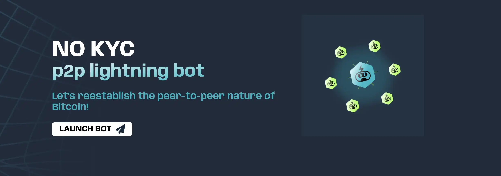
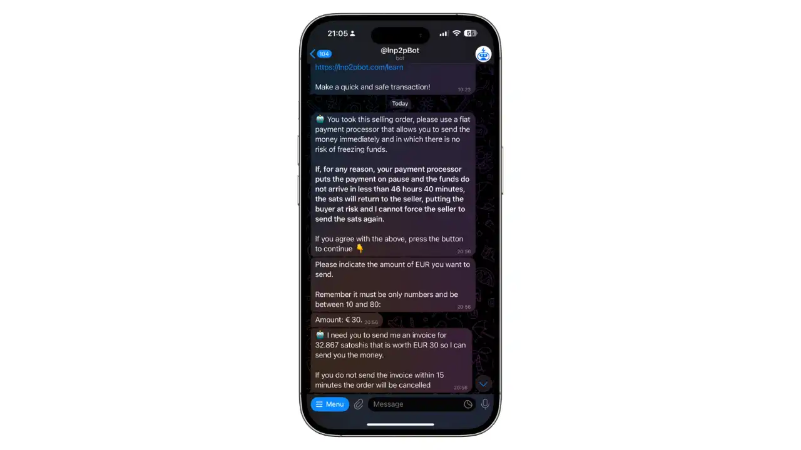
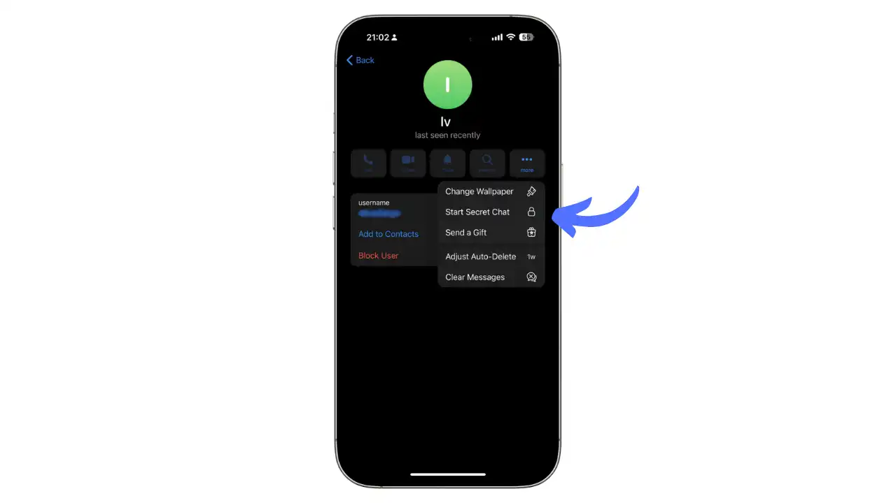
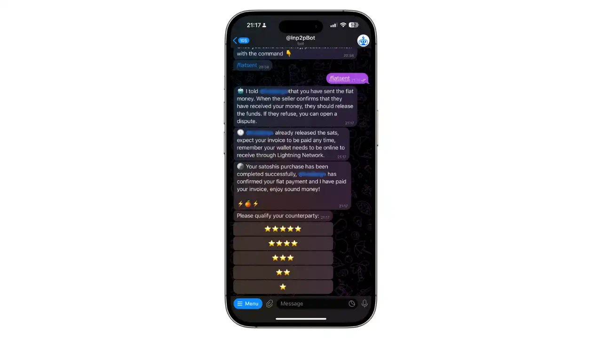
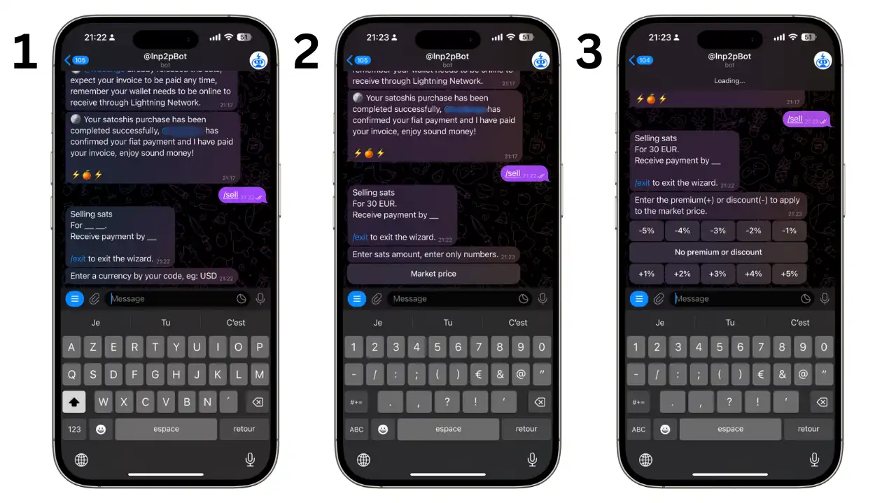
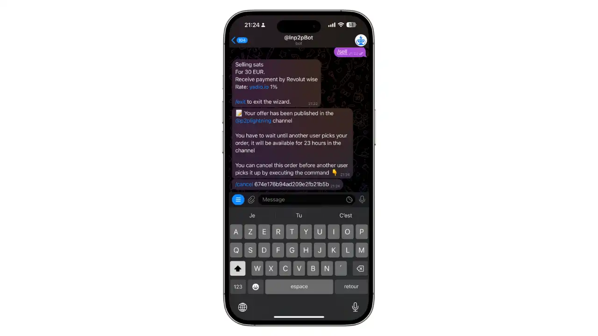
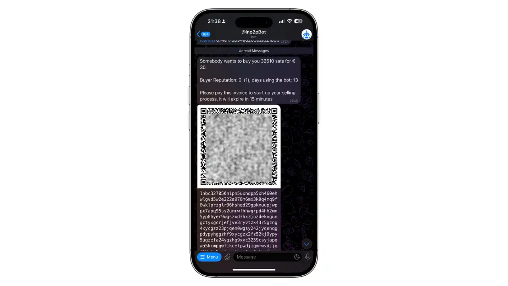

## Introduction

Les échanges de pair-à-pair (P2P) sans KYC sont essentiels pour préserver la confidentialité et l'autonomie financière des utilisateurs. Ils permettent des transactions directes entre individus sans nécessiter de vérification d'identité, ce qui est crucial pour ceux qui valorisent la vie privée. Pour une compréhension plus approfondie des concepts théoriques, consultez le cours BTC204 :

https://planb.network/courses/btc204

L'achat et la vente de bitcoin de pair-à-pair (P2P) est l'une des méthodes les plus privées pour acquérir ou céder des bitcoins. LNP2PBot est un bot Telegram open source qui facilite les échanges P2P sur le réseau Lightning, permettant des transactions rapides, à faible coût et sans KYC.

### Pourquoi utiliser Lnp2pbot ?

- Pas de KYC requis
- Transactions rapides sur Lightning Network
- Faibles frais 
- Interface simple via Telegram, une application de messagerie populaire et accessible partout dans le monde
- Système de réputation intégré
- Escrow automatique pour sécuriser les échanges
- Support multidevises
- Communauté active et grandissante

### Prérequis

Pour utiliser Lnp2pbot, vous aurez besoin :

1. Un portefeuille Lightning Network (Breez, Phoenix ou Blixt recommandés)
2. L'application Telegram installée (https://telegram.org/)
3. Un compte Telegram avec un nom d'utilisateur défini

## Installation et Configuration

### 1. Configurer votre portefeuille Lightning

Commencez par installer un portefeuille Lightning compatible. Voici nos recommandations détaillées :

**Portefeuilles recommandés**

- **[Breez](https://breez.technology)** : 
  - Excellent pour les débutants
  - Interface intuitive et moderne
  - Non-custodial (vous gardez le contrôle de vos fonds)
  - Parfaitement compatible avec Lnp2pbot
  - Disponible sur iOS et Android

Ci-dessous le lien vers le tutoriel pour ce wallet : 

https://planb.network/fr/tutorials/wallet/mobile/breez-46a6867b-c74b-45e7-869c-10a4e0263c06

- **[Phoenix](https://phoenix.acinq.co)** : 
  - Simple et fiable
  - Configuration automatique des canaux
  - Support natif des factures BOLT11
  - Excellent pour les transactions quotidiennes
  - Disponible sur iOS et Android
  
Ci-dessous le lien vers le tutoriel pour ce wallet : 

https://planb.network/fr/tutorials/wallet/mobile/phoenix-0f681345-abff-4bdc-819c-4ae800129cdf

- **[Blixt](https://blixtwallet.github.io)** : 
  - Plus technique mais très complet
  - Options de configuration avancées
  - Parfait pour les utilisateurs expérimentés
  - Open source
  - Disponible sur Android

Ci-dessous le lien vers le tutoriel pour ce wallet : 

https://planb.network/fr/tutorials/wallet/mobile/blixt-04b319cf-8cbe-4027-b26f-840571f2244f

**Notes importantes sur d'autres portefeuilles**

⚠️ **Important** : Avant de vendre des sats, assurez-vous que votre portefeuille supporte les factures "hold" (factures en attente), qui sont utilisées par le bot comme système d'escrow.

- **Wallet of Satoshi** : Fonctionne bien pour recevoir des sats, mais peut avoir des délais de mise à jour du solde en cas d'annulation d'une vente.
  
- **Muun** : Non recommandé car les paiements peuvent échouer en raison des limites de frais de routage du bot (maximum 0.2%).
  
- **Aqua** : Fonctionne pour recevoir des sats, mais peut avoir des délais importants (jusqu'à 48h) pour la mise à jour du solde en cas d'annulation d'une vente.

💡 **Conseil** : Pour une expérience optimale, privilégiez les portefeuilles recommandés (Breez, Phoenix ou Blixt).

⚠️ **Important** : N'oubliez pas de sauvegarder vos phrases de récupération dans un endroit sûr.

### 2. Démarrer avec Lnp2pbot

1. Cliquez sur ce lien pour accéder au bot : [@lnp2pBot](https://t.me/lnp2pbot)
2. Telegram s'ouvrira automatiquement
3. Cliquez sur "Start" ou envoyez la commande "/start"
4. Le bot vous demandera de créer un nom d'utilisateur (pseudo) si vous n'en avez pas encore
5. Le bot vous guidera à travers la configuration initiale

### 3. Rejoindre la communauté

- Rejoignez le canal principal : [@p2plightning](https://t.me/p2plightning)
- Support : [@lnp2pbotHelp](https://t.me/lnp2pbotHelp)

## Acheter et Vendre des Bitcoins

Il existe deux méthodes principales pour échanger des bitcoins sur Lnp2pbot :
1. Parcourir et répondre aux offres existantes dans le marketplace
2. Créer sa propre offre d'achat ou de vente

Dans ce guide, nous allons voir en détail comment :
- Acheter des bitcoins à partir d'une offre existante
- Vendre des bitcoins en créant votre propre offre

### Comment Acheter des Bitcoins

**1. Trouver et sélectionner une offre**

Parcourez les offres dans [@p2plightning](https://t.me/p2plightning) et cliquez sur le bouton "Acheter des satoshis" sous l'annonce qui vous intéresse.

**2. Valider l'offre et le montant**

1. Retournez sur le chat du bot
2. Confirmez votre choix de l'offre
3. Indiquez le montant en devise fiat que vous souhaitez acheter
4. Le bot vous demandera de fournir une facture Lightning (invoice) correspondant au montant en satoshis

**3. Mise en relation avec le vendeur**

Une fois l'invoice envoyée, le bot vous met en relation avec le vendeur.

**4. Communication avec le vendeur**

Cliquez sur le pseudo du vendeur pour ouvrir un canal de discussion privé où vous pourrez échanger les détails du paiement fiat.

**5. Confirmation du paiement**

Après avoir effectué le paiement fiat, utilisez la commande `/fiatsent` dans le chat du bot. Une fois la transaction terminée, vous pourrez noter le vendeur et la transaction sera clôturée.

### Comment Vendre des Bitcoins

**1. Créer une offre de vente**

Pour créer une offre de vente, il suffit d'utiliser la commande :

`/sell`

Le bot vous guidera ensuite étape par étape :
1. Choisissez votre devise
2. Indiquez le montant de satoshis à vendre
3. Pour le prix, vous avez deux options :
   - Définir un prix fixe pour la quantité de satoshis
   - Utiliser le prix du marché avec la possibilité d'appliquer un premium (positif ou négatif)

💡 **Conseil** : Le premium vous permet d'ajuster votre prix par rapport au cours du marché. Par exemple, un premium de -1% signifie que vous vendez 1% moins cher que le prix du marché.

**2. Confirmation de la création de l'ordre**

Une fois l'ordre créé, vous verrez une confirmation avec la possibilité d'annuler l'ordre en utilisant la commande `/cancel`.

**3. Gérer la vente**

1. Lorsqu'un acheteur répond à votre offre, vous recevrez une notification avec un QR code et une invoice à payer.
2. Vérifiez le profil et la réputation de l'acheteur.

3. Cliquez sur le pseudo de l'acheteur pour ouvrir un canal de discussion privé.
4. Communiquez les détails du paiement fiat à l'acheteur.
5. Attendez la confirmation du paiement fiat de l'acheteur.
6. Vérifiez la réception du paiement sur votre compte.

7. Confirmez la transaction avec `/release` et terminez l'ordre. Vous aurez la possibilité de noter l'acheteur.

## Bonnes Pratiques et Sécurité

### Conseils de sécurité

- Commencez par de petits montants
- Vérifiez toujours la réputation des utilisateurs
- Utilisez uniquement les méthodes de paiement suggérées
- Gardez toutes les communications dans le chat du bot
- Ne partagez jamais d'informations sensibles

### Système de réputation

- Chaque utilisateur a un score de réputation
- Les transactions réussies augmentent votre score
- Privilégiez les utilisateurs avec une bonne réputation
- Signalez tout comportement suspect aux modérateurs

### Résolution des litiges

1. En cas de problème, restez calme et professionnel
2. Utilisez la commande `/dispute` pour ouvrir un ticket
3. Fournissez toutes les preuves nécessaires
4. Attendez l'intervention d'un modérateur

## Comparaison avec d'autres solutions

Lnp2pbot présente plusieurs avantages et inconvénients par rapport à d'autres solutions d'échange P2P comme Peach, Bisq, HodlHodl, et Robosat :

### Avantages de Lnp2pbot
- **Pas de KYC requis** : Contrairement à certaines plateformes, Lnp2pbot ne nécessite pas de vérification d'identité, préservant ainsi la confidentialité des utilisateurs.
- **Transactions rapides** : Grâce au réseau Lightning, les transactions sont presque instantanées.
- **Faibles frais** : Les coûts de transaction sont réduits par rapport aux échanges traditionnels.
- **Disponibilité mobile** : LNP2PBot est accessible via Telegram, ce qui le rend facilement utilisable sur les appareils mobiles.
- **Simplicité d'utilisation** : L'interface de Lnp2pbot est intuitive, ce qui facilite son utilisation même pour les utilisateurs moins expérimentés.

### Inconvénients de Lnp2pbot
- **Dépendance à Telegram** : L'utilisation de Lnp2pbot nécessite un compte Telegram, ce qui peut ne pas convenir à tous les utilisateurs.
- **Moins de liquidité** : Comparé à des plateformes plus établies comme Bisq, la liquidité peut être plus limitée.

En comparaison, des solutions comme Bisq offrent une plus grande liquidité et une interface de bureau, mais peuvent impliquer des frais plus élevés et des temps de transaction plus longs. HodlHodl et Robosat, quant à eux, offrent également des échanges sans KYC mais avec des structures de frais et des interfaces différentes.

## Ressources Utiles

- Site officiel : https://lnp2pbot.com/
- Documentation : https://lnp2pbot.com/learn/
- GitHub : https://github.com/lnp2pBot/bot
- Support : [@lnp2pbotHelp](https://t.me/lnp2pbotHelp)
