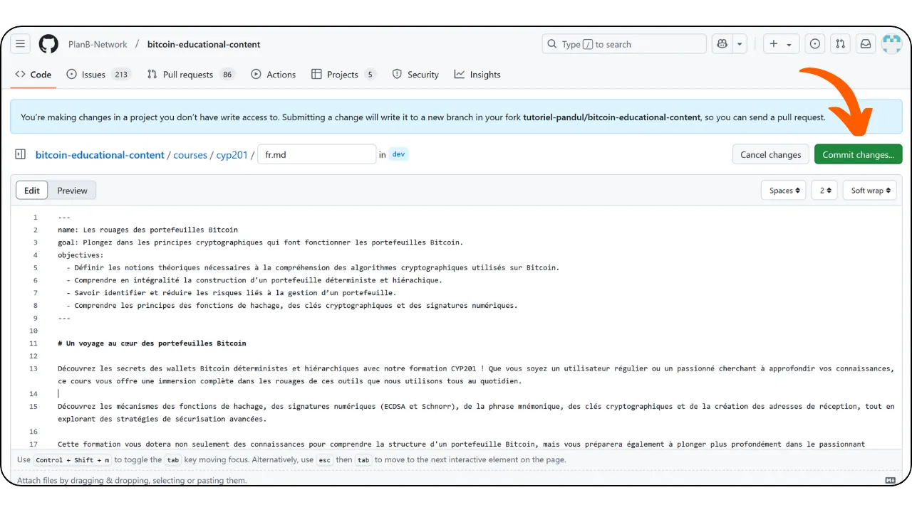

## In Summary

If you want to participate in reviewing and correcting content for Plan ₿ Network, join [our Telegram group](https://t.me/PlanBNetwork_ContentBuilder) dedicated to contributions. Introduce yourself briefly, then specify the content you’d like to review and the language. Make your corrections on a working branch and submit a PR once your review is complete.

If you didn’t understand the part above, don’t worry—this tutorial is for you!

---

## What is Plan ₿ Network?

Plan ₿ Network is a platform to learn about Bitcoin through numerous courses and tutorials for everyone. Currently, all our content is open-source, hosted on a GitHub repository, and open to contributions for review and content creation.

Plan ₿ Network aims to become the public square of the Bitcoin cyberspace, connecting and encouraging Bitcoin communities worldwide.

## Why contribute?

Plan ₿ Network is fundamentally multilingual, as our goal is to make Bitcoin resources accessible to everyone worldwide. We believe that language should not be a barrier to sovereign money.

To achieve this, we use a Human x AI approach. Through our [program](https://github.com/Asi0Flammeus/LLM-Translator), we can automatically translate our content into many languages. However, we need a fluent speaker to review it to ensure the content is intelligible and free of inappropriate terms.

If you want to help build this educational project to promote Bitcoin education in your community, you can start by reviewing a course or tutorial.

Additionally, as we cherish the *Value4Value* model, we will reward review contributions. The reward will be based on the content's length, the linguistic accuracy of our auto-translation, and the content's difficulty.

## Do I need to know how GitHub works?

You don’t need to be a GitHub expert to review content. While it’s always better to understand what you’re doing (and why), you can simply follow the instructions below to contribute.

However, if you’re unfamiliar with Git and GitHub and want to learn more, you can check out our introductory article on these tools:

https://planb.network/tutorials/others/contribution/basics-of-github-471f7f00-8b5a-4b63-abb1-f1528b032bbb

## 1. Create an account

- Create an account on [GitHub](https://github.com/) to start contributing. If you want guidance on creating your GitHub account, we also have a detailed tutorial:

https://planb.network/tutorials/others/contribution/create-github-account-a75fc39d-f0d0-44dc-9cd5-cd94aee0c07c

- You will also need an account on the messaging app [Telegram](https://telegram.org/).

## 2. Join the Telegram group

- Join [the PBN Content Builder group](https://t.me/PlanBNetwork_ContentBuilder) on Telegram.

- Briefly introduce yourself and specify the content you want to contribute to and the language in a message to the "General" channel.  
- A team member will then create an issue on GitHub for your future contribution. You’ll find all the information needed to start your review there.

## 3. Review and edit the content via GitHub's interface

- The issue contains a description (cf. **A**) with links to the original content and the file to review.  
- If you want to take charge of the review, leave a comment on the issue (cf. **B**) to indicate that you’ll be working on it. This prevents duplicated efforts.  
- Click the link next to the file to review (cf. **C**) to access the content.

* You can now view the GitHub interface of the file to review.
* The left panel allows you to navigate through your branch (cf. **A**) and files (cf. **B**).
* Click the pencil icon to start reviewing (cf. **C**).

* If this is your first contribution, GitHub will prompt you to fork the source repository. Just click the button.

* You’ll then arrive at the Editor interface (cf. **A**), where you can see the file path and corresponding branch (cf. **B**) and switch between edit and preview modes (cf. **C**).

NB. It’s recommended to review in the code window, with the original content displayed in a separate window. For instance, you can view the text on the Plan ₿ Network website or in the GitHub preview on a browser tab. Use `ctrl + F` to locate errors and make corrections in the code view as you go.

## 4. Commit changes

- You can start reviewing and correcting the content as needed.
- When you want to pause your session, you can commit your changes, even if the review isn’t finished. It’s like saving your progress on GitHub.
- Click the "Commit Changes..." button.

- Add a descriptive message for your changes (cf. **A**).
- Add more context in the description if necessary (cf. **B**).
- Click the "Propose changes" button (cf. **C**).

- If this is not your first contribution, GitHub will prompt you to create a new branch. You should never commit directly to the main `dev` branch. If you have already made commits on an existing working branch, select that branch. Otherwise, choose the "Create a new branch" option to create a new one.

- You’ll then access a page summarizing all your changes. By scrolling through it, you can see the precise modifications: deleted items appear in red, while added items appear in green.

- If you have not completed your review and wish to continue your work later, you can simply exit.
- As long as you have committed your changes, they are saved on your GitHub fork.
- To resume your work, go to your fork of the Plan ₿ Network content repository via your GitHub profile.

- Select the branch containing your progress (cf. **A**), locate your content file (cf. **B**), then click on the pencil icon to continue the review.

## 5. Create a PR with the dedicated branch

- If everything looks good and you’ve finished your changes, click the green "Create Pull Request" button.

- You’ll then arrive at the PR page. A Pull Request is a request to submit changes made on a branch of a remote repository for review and possible merging into the main branch.
- Add a title and a short description to your PR. The title should match the issue you’re working on. For example, if the issue title is `[TRANSLATION] Course CYP201 - FR`, use the same title for your PR (cf. **A**). In the description, mention the associated issue using its number, preceded by "Closes". This will automatically close the issue once the PR is merged (cf. **B**).  
- If everything looks good, click the green "Create Pull Request" button (cf. **C**).

## 6. Wait for review

- Congratulations, your PR has been submitted! You can track its progress in the "Pull requests" tab on [Plan ₿ Network's GitHub repository](https://github.com/PlanB-Network/bitcoin-educational-content/pulls):

- Thank you very much for your contribution! After approval, a Plan ₿ Network team member will contact you to send your reward. **Payments are made exclusively via the Lightning Network**.
- If you’d like to start again, return to step 2 and send a new message in the Telegram group to continue contributing to other content. Make sure to sync your fork before creating a new working branch. To do this, go to the homepage of your fork, select the main branch named `dev` (cf. **A**), then click on the "Sync fork" button (cf. **B**). If updates are available for your fork, an "Update branch" button will appear. Simply click it to perform the update.

- If you have any remarks, questions, or comments about this project, feel free to send a DM [to the contributors' Telegram group](https://t.me/PlanBNetwork_ContentBuilder).
