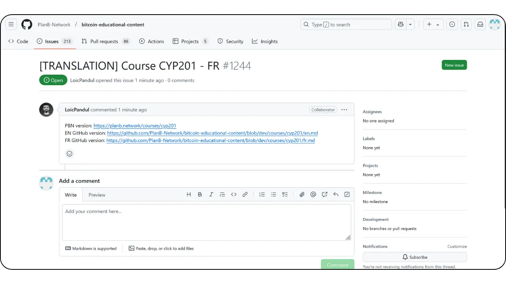
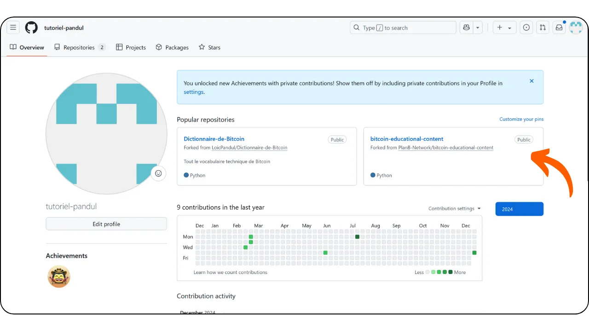
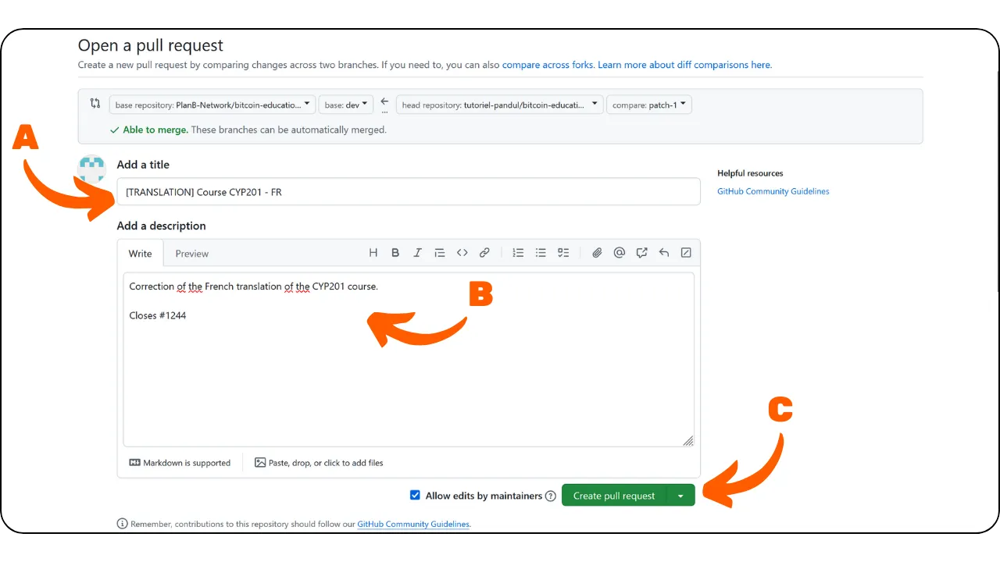

## En résumé

Si vous souhaitez participer à la relecture et à la correction de contenu pour Plan ₿ Network, rejoignez [notre groupe Telegram](https://t.me/PlanBNetwork_ContentBuilder) dédié aux contributions. Présentez-vous brièvement, puis indiquez le contenu que vous aimeriez relire ainsi que la langue concernée. Effectuez vos corrections sur une branche de travail et soumettez une PR une fois votre révision terminée.

Si vous n'avez pas compris la partie ci-dessus, ne vous inquiétez pas, ce tutoriel est fait pour vous !

---

## Qu'est-ce que Plan ₿ Network ?

Plan ₿ Network est une plateforme pour apprendre sur Bitcoin via de nombreux cours et tutoriels pour tous. Actuellement, tout notre contenu est open-source, hébergé sur un repo GitHub, et ouvert aux contributions pour la révision et la création de contenu.

Plan ₿ Network vise à devenir la place publique du cyberespace Bitcoin, en reliant et en encourageant les communautés Bitcoin à travers le monde.

## Pourquoi contribuer ?

Plan ₿ Network est fondamentalement multilingue, car notre objectif est de rendre les ressources sur Bitcoin accessibles à tous dans le monde. Nous croyons que la langue ne devrait pas être une barrière à la monnaie souveraine.

Nous utilisons donc une approche Humain x AI pour atteindre cet objectif. Grâce à notre [programme](https://github.com/Asi0Flammeus/LLM-Translator), nous pouvons automatiquement traduire notre contenu dans de nombreuses langues. Cependant, nous avons besoin qu'une personne qui parle couramment la langue le révise pour s'assurer que le contenu est intelligible et exempt de termes inappropriés.

Si vous souhaitez nous rejoindre pour construire ce projet éducatif afin de promouvoir l'éducation sur Bitcoin dans votre communauté, vous pouvez commencer par réviser un cours ou un tutoriel.

De plus, comme nous chérissons le modèle *Value4Value*, nous récompenserons les contributions de révision. La récompense sera établie sur la longueur du contenu, l'exactitude linguistique de notre auto-traduction et la difficulté du contenu.

## Dois-je savoir comment fonctionne GitHub ?

Vous n'avez pas besoin d'être un expert de GitHub pour faire une révision de contenu.
Bien qu'il soit toujours mieux de comprendre ce que vous faites (et pourquoi), vous pouvez simplement suivre les instructions ci-dessous pour contribuer.

Toutefois, si vous ne connaissez pas du tout le fonctionnement de Git et de GitHub et que vous souhaitez en savoir plus, vous pouvez découvrir notre article d'introduction sur ces outils.

https://planb.network/tutorials/others/contribution/basics-of-github-471f7f00-8b5a-4b63-abb1-f1528b032bbb

## 1. Créer un compte

* Créez un compte sur [GitHub](https://github.com/) pour commencer à contribuer. Si vous souhaitez être guidé dans la manière de créer votre compte sur GitHub, nous avons également un tutoriel détaillé.

https://planb.network/tutorials/others/contribution/create-github-account-a75fc39d-f0d0-44dc-9cd5-cd94aee0c07c

- Vous aurez également besoin d'un compte sur l'application de messagerie [Telegram](https://telegram.org/).

## 2. Rejoindre le groupe Telegram

- Rejoignez [le groupe PBN Content Builder](https://t.me/PlanBNetwork_ContentBuilder) sur Telegram.

- Présentez-vous brièvement et précisez le contenu spécifique sur lequel vous souhaitez contribuer ainsi que la langue concernée, en envoyant un message dans le canal "General".  
- Un membre de l’équipe créera ensuite une issue sur GitHub correspondant à votre future contribution. Vous y trouverez toutes les informations nécessaires pour commencer votre relecture.

## 3. Réviser et modifier le contenu via l'interface GitHub

- L’issue contient une description (cf. **A**) avec des liens vers le contenu original et le fichier à réviser.  
- Si vous souhaitez prendre en charge la révision, laissez un commentaire sur l’issue (cf. **B**) pour indiquer que vous allez travailler dessus. Cela évitera toute duplication de travail.  
- Cliquez sur le lien à côté du fichier à réviser (cf. **C**) pour accéder au contenu.

* Vous pouvez maintenant voir l'interface GitHub du fichier à réviser.
* Le panneau de gauche vous permet de naviguer à travers votre branche (cf. **A**) et les fichiers (cf. **B**).
* Cliquez sur l'icône du stylo pour commencer la révision (cf. **C**).

* Si c'est votre première contribution, GitHub vous demandera de faire un fork du dépôt source. Cliquez simplement sur le bouton.

* Ensuite, vous arriverez sur l'interface de l'Éditeur (cf. **A**), où vous pouvez voir le chemin du fichier et la branche correspondante (cf. **B**), et vous pouvez basculer entre le mode édition et le mode aperçu (cf. **C**).

NB. Il est recommandé d’effectuer la révision dans la fenêtre de code, avec le contenu original affiché dans une fenêtre séparée à côté. Vous pouvez, par exemple, consulter le texte sur le site de Plan ₿ Network ou dans l’aperçu GitHub sur une page de votre navigateur. Effectuez ensuite les modifications dans la vue de code au fur et à mesure, en utilisant la commande `ctrl + F` pour localiser rapidement les erreurs à corriger.

## 4. Commit les modifications

* Vous pouvez commencer à relire le contenu et le corriger si besoin.
* Lorsque vous souhaitez arrêter votre session de révision, vous pouvez commit vos modifications, même si la révision n'est pas terminée. C'est un peu comme si vous sauvegardiez vos modifications sur GitHub.
* Cliquez sur le bouton "Commit Changes...".

* Ajoutez un message descriptif sur votre changement (cf. **A**).
* Ajoutez plus le contexte dans la description si nécessaire (cf. **B**).
* Cliquez sur le bouton "Propose changes" (cf. **C**).

- Si ce n'est pas la première fois que vous contribuez, GitHub vous proposera de créer une nouvelle branche. Il ne faut jamais effectuer de commits directement sur la branche principale `dev`. Si vous avez déjà effectué des commits sur une branche de travail existante, sélectionnez cette branche. Sinon, choisissez l’option "Create a new branch" pour en créer une nouvelle.

- Vous accéderez ensuite à une page récapitulant tous vos changements. En la faisant défiler, vous pourrez visualiser précisément les modifications apportées : les éléments supprimés apparaissent en rouge, tandis que les éléments ajoutés sont en vert.

- Si vous n'avez pas terminé votre révision et que vous souhaitez continuer votre travail plus tard, vous pouvez simplement quitter.
- Du moment que vous avez bien commit vos modifications, elles sont enregistrées sur votre fork GitHub.
- Pour reprendre votre travail, rendez-vous sur votre fork du dépôt de contenu Plan ₿ Network via votre profil GitHub.

- Sélectionnez la branche contenant votre progression (cf. **A**), localisez votre fichier de contenu (cf. **B**), puis cliquez sur l’icône en forme de stylo pour continuer la révision.

## 5. Créer une PR avec la branche dédiée

- Si tout vous convient et que vous avez terminé vos modifications, vous pouvez cliquer sur le bouton vert "Create Pull Request".

- Vous arriverez ensuite sur la page de la PR. Une Pull Request est une demande permettant à un contributeur de soumettre des modifications effectuées sur une branche d’un dépôt distant pour qu’elles soient examinées et éventuellement fusionnées dans la branche principale du dépôt.
- Ajoutez un titre et une courte description à votre PR. Le titre doit correspondre à celui de l’issue sur laquelle vous travaillez. Par exemple, si le titre de l’issue est `[TRANSLATION] Course CYP201 - FR`, utilisez ce même titre pour votre PR (cf. **A**). Dans la description, mentionnez l’issue associée en utilisant son numéro, précédé de la mention `"Closes"`. Cela permettra de fermer automatiquement l’issue une fois la PR fusionnée (cf. **B**).  
- Si tout vous semble correct, cliquez sur le bouton vert "Create Pull Request" (cf. **C**).

## 6. Attendre la révision

- Félicitations, votre PR a été envoyée ! Vous pouvez suivre son avancement dans l'onglet "Pull requests" sur [le dépôt GitHub de Plan ₿ Network](https://github.com/PlanB-Network/bitcoin-educational-content/pulls) :

- Merci beaucoup pour votre contribution ! Après approbation, un membre de l'équipe de Plan ₿ Network vous contactera pour vous envoyer votre récompense. **Les paiements se font uniquement sur le Lightning Network**.
* Si vous souhaitez recommencer, retournez à l'étape 2 et envoyez un nouveau message sur le groupe Telegram pour continuer à contribuer sur d'autres contenus. Pensez à synchroniser votre fork avant de créer une nouvelle branche de travail. Pour cela, rendez-vous sur la page d’accueil de votre fork, sélectionnez la branche principale nommée `dev` (cf. **A**), puis cliquez sur le bouton "Sync fork" (cf. **B**). Si des mises à jour sont disponibles pour votre fork, un bouton "Update branch" apparaîtra. Cliquez simplement dessus pour effectuer la mise à jour.

* Si vous avez des remarques, des questions ou des commentaires sur ce projet, vous pouvez envoyer un DM [sur le groupe Telegram des contributeurs](https://t.me/PlanBNetwork_ContentBuilder).
