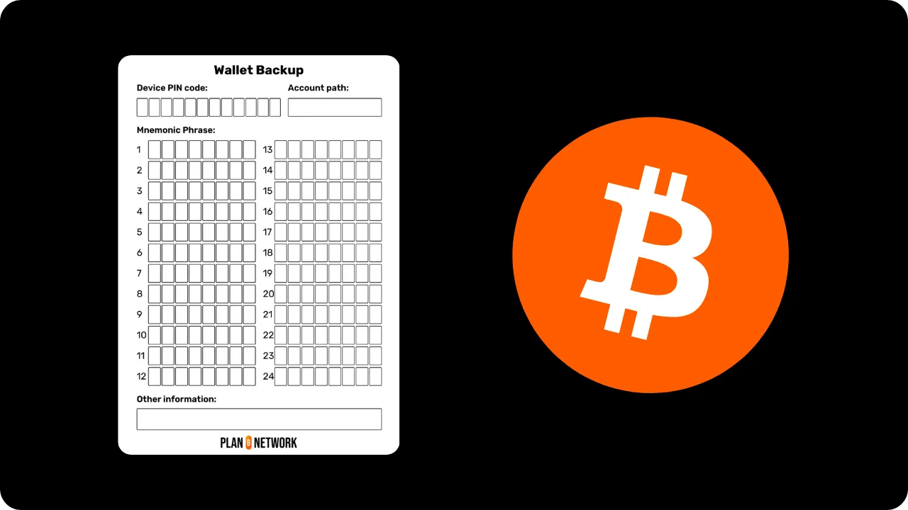
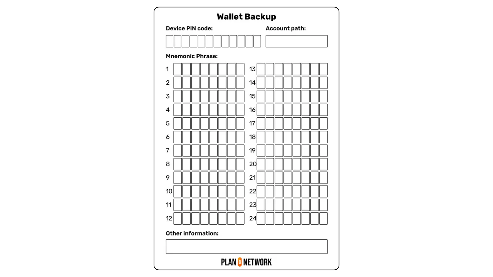
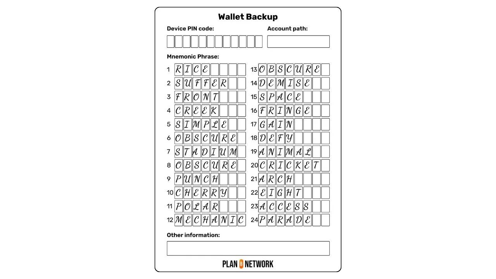
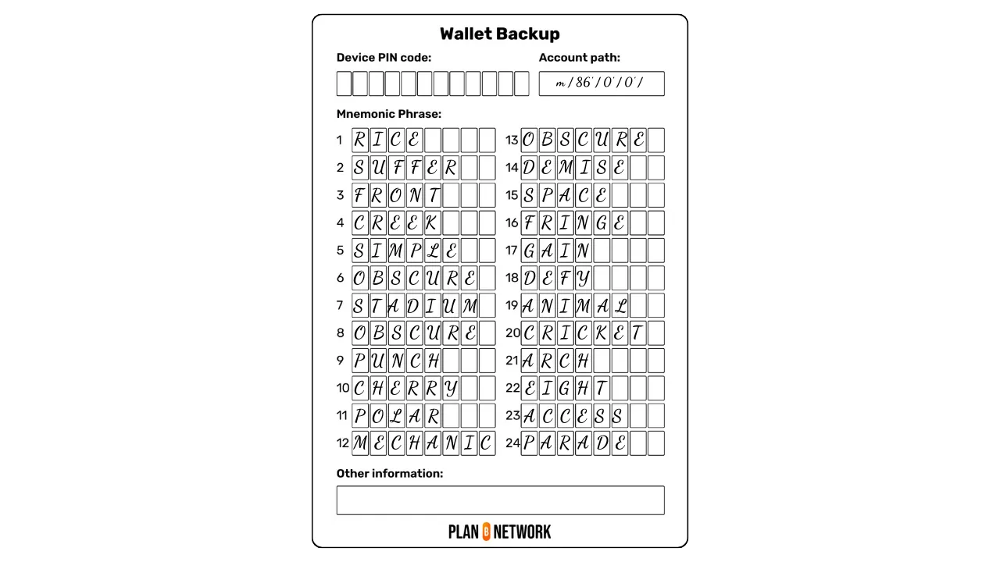
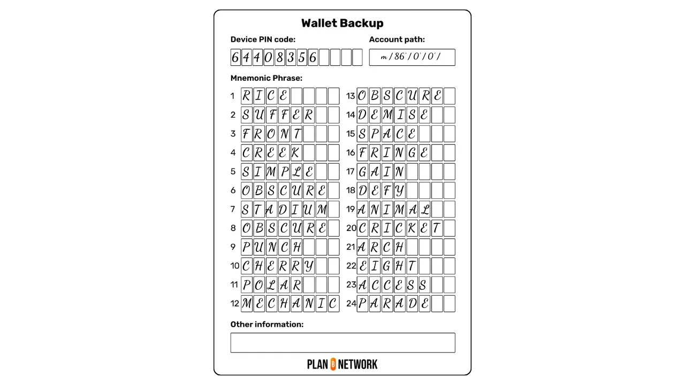

Lorsque vous créez un nouveau portefeuille Bitcoin, que ce soit via un logiciel ou un hardware wallet, vous recevez une phrase mnémonique composée de 12 ou de 24 mots. Cette phrase est très importante, car elle est à l'origine de la dérivation de toutes les clés privées qui sécurisent vos bitcoins. Il faut donc la sauvegarder soigneusement pour garantir la récupération de vos fonds en cas de casse, de vol ou de perte du support de votre portefeuille.

Dans ce tutoriel, nous allons explorer les bonnes pratiques pour sauvegarder votre phrase mnémonique de manière sécurisée, afin de ne pas perdre l’accès à vos bitcoins.

## Sensibilisation aux risques

La phrase mnémonique donne un accès complet et non restreint à tous vos bitcoins. N'importe qui en possession de cette phrase peut subtiliser vos fonds, même sans accès physique au support qui héberge votre portefeuille.

Cela signifie, par exemple, que si vous utilisez un portefeuille Bitcoin sur une Ledger, toute personne ayant accès à votre phrase mnémonique peut dérober l’intégralité de vos bitcoins, même sans avoir accès à la Ledger elle-même. C'est pourquoi **il ne faut jamais partager votre phrase**, quelle que soit la situation.

Cette phrase est donc l'information unique qui vous permet de restaurer l’accès à vos bitcoins en cas de perte, de vol ou de détérioration du support du portefeuille. Prenons à nouveau l’exemple de la Ledger : si vous perdez l’appareil, vous pourrez retrouver vos fonds en saisissant votre phrase mnémonique sur une nouvelle Ledger ou sur tout autre portefeuille compatible, qu’il soit logiciel ou matériel.

Il est donc important de sauvegarder cette phrase avec la plus grande précaution et de la conserver dans un lieu sécurisé, comme nous le détaillerons dans les sections suivantes.

**Ainsi, votre phrase mnémonique est exposée à deux principaux risques : le vol et la perte.**

Le vol peut principalement survenir de deux manières :
- Une personne accède physiquement à votre sauvegarde, par exemple lors d’un cambriolage ou via une personne de votre entourage ;
- Vous avez partagé volontairement ou involontairement votre phrase avec une autre personne.

Pour éviter les vols physiques de votre sauvegarde de phrase mnémonique, il est important de la conserver dans un lieu sécurisé. Nous aborderons ce point en détail dans les sections suivantes.

Concernant les tentatives de vols à distance, gardez toujours en tête qu’il ne faut jamais partager votre phrase mnémonique, quelle que soit la situation. Les tentatives de phishing sont fréquentes : emails frauduleux, sites web imitant ceux de portefeuilles officiels ou demandes directes via divers canaux de communication. Si quelqu’un vous demande votre phrase, c’est une arnaque, même en cas d’urgence ! Il est courant que des voleurs se fassent passer pour des employés du fabricant de votre hardware wallet, mais sachez que ces entreprises ne vous demanderont jamais votre phrase, quelle que soit la situation. Soyez donc extrêmement vigilant face aux communications reçues, qu’elles soient par email, téléphone, courrier, sur les réseaux sociaux ou même en personne.

Lorsque vous devez entrer votre phrase dans un hardware wallet ou un logiciel pour restaurer l’accès à votre portefeuille après un problème avec le support initial, prenez le temps de vérifier l’authenticité et l’intégrité du matériel ou du logiciel que vous utilisez. Ne cédez pas à la panique, et procédez méthodiquement.

Par ailleurs, soyez prudent lorsque vous manipulez votre phrase mnémonique. Assurez-vous de ne pas être observé par d’autres personnes ou par une caméra.

En ce qui concerne le risque de perte, celui-ci peut survenir pour trois raisons principales : la perte du support de sauvegarde, sa dégradation ou une erreur lors de sa notation. Nous examinerons précisément comment éviter ou minimiser ces trois risques dans les sections suivantes.

## Le support

Pour sauvegarder votre phrase de récupération, il faut la noter sur un support physique, comme du papier ou du métal. N'utilisez jamais un support numérique : ne la sauvegardez pas dans un fichier texte, ne la prenez pas en photo et ne la stockez pas dans un gestionnaire de mots de passe. Ces méthodes augmentent considérablement la surface d'attaque par rapport à un support physique. La règle est donc claire : utilisez du papier, du carton ou du métal pour sauvegarder votre phrase.

Si noter votre phrase sur un simple morceau de papier constitue déjà une bonne pratique, opter pour un support en métal, comme de l’acier inoxydable, offre une sécurité supplémentaire. Ce type de support protège votre phrase mnémonique des risques liés aux incendies, inondations ou écroulements pouvant affecter le lieu de stockage.

Pour ceux qui recherchent une option économique pour sauvegarder leur phrase sur un support en métal, [la méthode DIY du "*SAFU Ninja*"](https://jlopp.github.io/metal-bitcoin-storage-reviews/reviews/safu-ninja/) est une excellente solution. Il suffit d’acheter des rondelles métalliques, une vis et un écrou dans le commerce. Ensuite, vous gravez les mots de votre phrase sur chaque rondelle en veillant à bien les numéroter, puis vous les assemblez sur la vis avec l’écrou. Cette méthode à cout réduit offre déjà une bonne résistance.


Crédit image : [*SAFU Ninja Review*, Jameson Lopp](https://jlopp.github.io/metal-bitcoin-storage-reviews/reviews/safu-ninja/).

Si vous préférez investir dans un dispositif complet de sauvegarde en métal, je vous recommande de consulter [les tests de résistance réalisés par Jameson Lopp](https://jlopp.github.io/metal-bitcoin-storage-reviews/), qui évaluent la plupart des solutions disponibles sur le marché. Je vous conseille de privilégier les supports constitués d’une seule pièce, comme une plaque de métal à graver, frapper ou poinçonner. Ces dispositifs offrent généralement une résistance bien supérieure aux systèmes utilisant des lettres indépendantes à assembler.

Si vous optez pour un support en papier, plusieurs options s'offrent à vous : une simple feuille blanche, le support cartonné souvent fourni avec votre hardware wallet, ou encore notre modèle téléchargeable que vous pouvez imprimer [en cliquant ici](https://github.com/PlanB-Network/bitcoin-educational-content/blob/dev/resources/bet/wallet-backup-sheet/assets/mnemonic-sheet.pdf).



## La sauvegarde

Maintenant que vous avez choisi votre support physique, il est temps d'y noter votre phrase de récupération ! Pour éviter de perdre vos bitcoins, suivez ces quelques bonnes pratiques.

Tout d’abord, assurez-vous de ne pas être observé, que ce soit par d’autres personnes ou par des caméras, au moment où vous notez votre phrase.

Prenez ensuite le temps d’écrire chaque mot de manière claire et lisible. Vous pourriez avoir besoin de relire votre phrase dans plusieurs années, ou quelqu’un d’autre pourrait avoir besoin de le faire dans le cadre d’un héritage. Une écriture soignée est donc essentielle.

En théorie, il est possible de n’écrire que les 4 premières lettres de chaque mot, car dans la liste des 2048 mots du BIP39, aucun mot ne partage les mêmes 4 premières lettres dans le même ordre. Cependant, si votre support dispose de suffisamment d’espace, je vous recommande de sauvegarder chaque mot dans son intégralité. Cela peut s’avérer utile en cas de dégradation partielle du support. Par exemple, si vous notez seulement `accu` pour le mot `accuse` et que la lettre `u` venait à disparaître, vous pourriez hésiter entre `accuse`, `access`, `accident` ou `account`. En revanche, avec l’intégralité du mot, même si une lettre manque, il reste facile de reconnaître le mot correct.

Il est également essentiel d’écrire vos mots dans le bon ordre. Si vous avez vos 24 mots mais que vous ignorez leur séquence exacte, il sera impossible de récupérer votre portefeuille. Numéroter les mots est tout aussi important : en cas de dégradation du support ou si les mots se retrouvent désorganisés, leur numérotation vous permettra de les remettre facilement dans le bon ordre.



De plus, il est important de comprendre que, théoriquement, la phrase mnémonique seule ne suffit pas toujours pour retrouver l’accès à vos bitcoins. Il est également nécessaire de connaître les chemins de dérivation utilisés pour générer les clés. Si vous utilisez un portefeuille SingleSig avec un chemin standard, il sera relativement simple de récupérer vos clés. Cependant, avec un chemin non standard, cela pourrait devenir impossible, même en possession de la phrase mnémonique. Pour éviter ce problème, je vous recommande vivement de noter, sur votre support, le chemin de dérivation du compte que vous utilisez. Vous pouvez retrouver cette information dans les paramètres de votre logiciel de portefeuille. Par exemple, pour un portefeuille Taproot standard, le chemin de dérivation par défaut sera :

```txt
m / 86' / 0' / 0' /
```



Si vous utilisez un portefeuille multisig ou un portefeuille avec des scripts complexes incluant des clés de récupération, comme ceux proposés par le logiciel Liana, il est indispensable de sauvegarder vos **Output Script Descriptors**. Ces descriptors contiennent toutes les informations nécessaires, en complément des phrases de récupération, pour retrouver l’accès à vos bitcoins.

Vous pouvez également enrichir votre sauvegarde avec des informations supplémentaires liées au support de votre portefeuille. Par exemple, notez le code PIN permettant de déverrouiller votre hardware wallet ou les mots anti-phishing si vous utilisez une COLDCARD.



En revanche, si vous utilisez une passphrase, évitez absolument de la noter sur le même support que votre phrase mnémonique. La passphrase a précisément pour rôle de protéger votre portefeuille en cas de vol de cette dernière. Pour en savoir davantage sur l’utilisation de la passphrase, je vous invite à consulter ce tutoriel complémentaire :

https://planb.network/tutorials/wallet/backup/passphrase-a26a0220-806c-44b4-af14-bafdeb1adce7

Une fois votre phrase mnémonique sauvegardée sur un support physique, il est fortement recommandé d’effectuer un test de récupération tant que votre portefeuille nouvellement créé est encore vide. Ce test consiste à noter une information témoin, à supprimer volontairement le portefeuille vide, puis à essayer de le restaurer en utilisant uniquement votre sauvegarde physique de la phrase mnémonique. Cela vous permet de vérifier que votre sauvegarde est complète et sans erreur de saisie. Vous pourrez également vous familiariser avec le processus de récupération. Ainsi, en cas de récupération dans le futur, vous serez mieux préparé et éviterez le stress d’une première tentative en situation réelle. Pour en savoir plus sur la réalisation de ce test, consultez cet autre tutoriel :

https://planb.network/tutorials/wallet/backup/recovery-test-5a75db51-a6a1-4338-a02a-164a8d91b895

Enfin, se pose également la question du nombre de sauvegardes. Ce choix dépend entièrement de votre situation personnelle. Limiter le nombre de copies, par exemple en ne notant votre phrase mnémonique qu’une seule fois sur un support, réduit le risque de vol, mais augmente le risque de perte. À l’inverse, réaliser plusieurs copies diminue le risque de perte, mais accroît celui de vol. Il vous appartient donc de trouver un équilibre adapté à vos besoins et de déterminer le nombre de copies qui vous semble le plus approprié.

## Le stockage

Maintenant que vous avez soigneusement sauvegardé votre phrase mnémonique, il est temps de choisir un lieu de stockage adapté. Ce lieu dépendra de votre stratégie de sécurisation. Dans tous les cas, privilégiez un endroit à l’abri des regards, où il est peu probable que quelqu’un tombe dessus, tout en restant accessible pour permettre des vérifications périodiques. Assurez-vous également que le lieu soit protégé des intempéries pour éviter une dégradation du support.

Je vous déconseille également de stocker votre phrase mnémonique dans des lieux où vous n’êtes pas souverain, tels qu’un coffre chez un notaire ou dans une banque. Ces options peuvent sembler sécurisées, mais elles impliquent que vous dépendiez d’un tiers pour accéder à votre sauvegarde, ce qui va à l’encontre des principes fondamentaux de Bitcoin.

Pour renforcer la sécurité, je recommande d’utiliser une pochette plastique inviolable ou un système de sceau similaire. Cela vous permettra de vérifier que personne n’a eu accès à votre phrase. Par exemple, si vous stockez votre phrase chez vous et recevez des invités, il peut être impossible de savoir si quelqu’un l’a vue, mémorisée ou photographiée. Une pochette inviolable rend ce type de vérification simple : si elle est intacte, vous êtes assuré que votre phrase est restée secrète. Ces pochettes, entièrement opaques, sont disponibles en ligne ou dans des magasins spécialisés sur Bitcoin.


Enfin, lorsque votre phrase est stockée dans une enveloppe inviolable, n’oubliez pas de noter l’identifiant unique de cette enveloppe. Cela vous permettra de vérifier son authenticité lors de vos contrôles.

## La gestion dans le temps

Maintenant que votre phrase est soigneusement stockée, il est important de mettre en place un suivi régulier. De manière périodique, vérifiez que votre phrase est toujours présente à son lieu de stockage et que son enveloppe opaque n’a pas été ouverte.

Lors de ces contrôles, vous pouvez également ouvrir l’enveloppe pour examiner l’état du support. Assurez-vous qu’il n’est pas endommagé et que la phrase reste parfaitement lisible. Si vous constatez les moindres signes de dégradation, il est préférable de créer une nouvelle copie à partir de votre hardware wallet. Vérifiez que cette nouvelle copie est fonctionnelle, puis détruisez proprement la sauvegarde détériorée pour éviter tout risque de fuite.

Enfin, la gestion de la phrase mnémonique soulève également la question de la transmission en cas d’héritage. Ce sujet sera traité en détail dans un prochain tutoriel.

## Aller plus loin

Pour aller plus loin et renforcer encore davantage votre stratégie de sécurisation, je vous recommande d’apprendre le fonctionnement technique de votre portefeuille Bitcoin. En comprenant comment interagissent ses différents éléments, ainsi que leur importance et leurs implications, vous serez en mesure d’affiner votre stratégie de sécurisation en ayant pleinement conscience des risques. En particulier, si vous comprenez au niveau technique ce que permet la phrase mnémonique, vous pourrez ajuster la manière dont vous la notez, la stockez et la gérez au fil du temps.

C’est pourquoi je vous invite à suivre la formation gratuite CYP201 proposée sur Plan ₿ Network. Cette formation explique en détail tous les rouages des portefeuilles Bitcoin, ce qui vous permet de maîtriser les aspects techniques essentiels pour sécuriser efficacement vos fonds :

https://planb.network/courses/cyp201

Si vous avez trouvé ce tutoriel utile, je vous serais reconnaissant de laisser un pouce vert ci-dessous. N'hésitez pas à partager cet article sur vos réseaux sociaux. Merci beaucoup !
