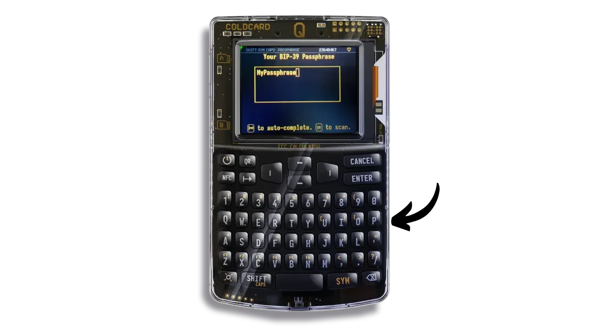
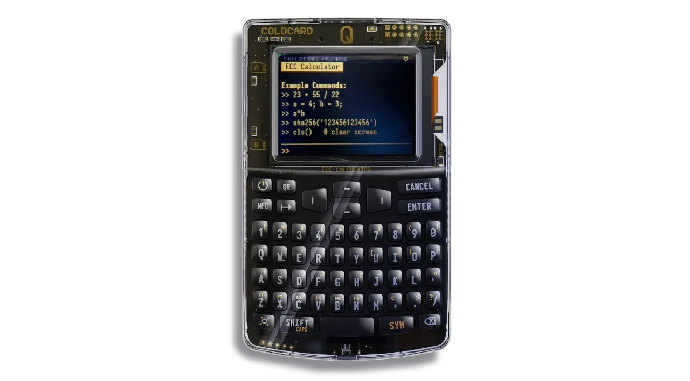

Dans un tutoriel précédent, nous avons découvert la configuration initiale de la COLDCARD Q et ses fonctionnalités de base pour les débutants. Si vous venez de recevoir votre COLDCARD Q et ne l'avez pas encore configurée, je vous recommande de commencer par ce tutoriel avant de poursuivre ici :

https://planb.network/tutorials/wallet/hardware/coldcard-q-73e86d1a-6fe6-4d8b-bb15-8690298020e3

Ce nouveau tutoriel est dédié aux options avancées de la COLDCARD Q, pensées pour les utilisateurs avancés et paranoïaques. En effet, les COLDCARD se distinguent des autres hardware wallets par leurs nombreuses fonctionnalités de sécurité avancées. Vous n'êtes évidemment pas obligé d'utiliser toutes ces options. Choisissez uniquement celles qui correspondent à votre stratégie de sécurisation.

**Attention**, l'utilisation incorrecte de certaines de ces options avancées peut entraîner la perte de vos bitcoins ou détruire votre hardware wallet. Je vous recommande donc vivement de lire attentivement les conseils et explications pour chaque option.

Avant de commencer, assurez-vous d'avoir accès à la sauvegarde physique de votre phrase mnémonique de 12 ou de 24 mots, et vérifiez sa validité via le menu suivant : `Advanced/Tools > Danger Zone > Seed Functions > View Seed Words`.

## La passphrase BIP39

Si vous ne savez pas ce qu'est une passphrase BIP39 ou si son fonctionnement ne vous est pas totalement clair, je vous recommande fortement de consulter ce tutoriel préalable, qui couvre les bases théoriques nécessaires pour comprendre les risques associés à l'utilisation d'une passphrase :

https://planb.network/tutorials/wallet/backup/passphrase-a26a0220-806c-44b4-af14-bafdeb1adce7

Gardez à l'esprit qu'une fois la passphrase configurée sur votre portefeuille, votre phrase mnémonique seule ne suffira plus pour retrouver l'accès à vos bitcoins. Vous aurez besoin à la fois de la phrase mnémonique et de la passphrase. De plus, vous devrez saisir la passphrase chaque fois que vous déverrouillerez votre COLDCARD Q. Cela renforce la sécurité en rendant l'accès physique à la COLDCARD et la connaissance du code PIN insuffisants sans la passphrase.

Sur les COLDCARD, vous avez deux options pour gérer votre passphrase :
1. **La saisie classique :** Vous entrez manuellement la passphrase à chaque utilisation, comme sur les autres hardware wallets. La COLDCARD Q simplifie cette tâche grâce à son clavier complet.
2. **Le stockage sur microSD :** Vous pouvez choisir de chiffrer votre passphrase et de la stocker sur une carte microSD. Dans ce cas, vous devrez insérer la microSD dans la COLDCARD Q chaque fois que vous l’utiliserez. Notez que cette microSD ne fonctionnera que sur votre COLDCARD Q et ne constitue pas une sauvegarde. Il est donc très important de conserver en plus une copie de votre passphrase sur un support physique, comme du papier ou du métal.

Pour configurer votre passphrase BIP39, accédez au menu "*Passphrase*".

Saisissez votre passphrase à l’aide du clavier. Assurez-vous de choisir une passphrase robuste (longue et aléatoire) et d’en réaliser une sauvegarde physique.

Après avoir configuré votre passphrase, la COLDCARD Q vous montre l'empreinte de la clé maîtresse du nouveau portefeuille associé à cette passphrase. Assurez-vous de sauvegarder cette empreinte. Lorsque vous saisirez de nouveau votre passphrase lors des utilisations futures de votre appareil, vous pourrez vérifier que l'empreinte affichée correspond à celle que vous avez sauvegardée. Cette vérification vous assure que vous n'avez pas commis d'erreur en saisissant votre passphrase.

Vous pouvez maintenant appuyer sur "*ENTER*" pour appliquer cette passphrase à votre phrase mnémonique et ainsi activer le nouveau portefeuille. Si vous préférez enregistrer cette passphrase sur une microSD, insérez la carte dans le port approprié et appuyez sur "*1*".

Votre passphrase est désormais appliquée. L'empreinte de la clé apparaît sur l'écran d'accueil ainsi qu'en haut de l'écran.

À chaque déverrouillage de votre COLDCARD Q, vous devrez accéder au menu "*Passphrase*" et entrer votre passphrase de la même manière que nous venons de le faire, pour l'appliquer à la phrase mnémonique stockée dans l'appareil et accéder au bon portefeuille Bitcoin.

Si vous avez sauvegardé la passphrase sur une carte microSD, lors de chaque utilisation, insérez-la dans la COLDCARD et accédez au menu "*Passphrase*". Votre COLDCARD chargera la passphrase directement depuis la microSD, donc vous n'aurez pas besoin de la saisir manuellement. Cliquez sur "*Restore Saved*".

Vérifiez que la longueur et la première lettre de la passphrase chargée sont correctes.

Confirmez que l'empreinte affichée correspond à celle de votre portefeuille et cliquez sur "*Restore*".

Gardez à l'esprit que l'utilisation d'une passphrase signifie que vous devrez importer un nouvel ensemble de clés dérivées de la combinaison de votre phrase mnémonique et de la passphrase dans votre logiciel de gestion de portefeuille (comme Sparrow Wallet). Pour ce faire, suivez l'étape "*Configurer un nouveau portefeuille sur Sparrow*" dans cet autre tutoriel :

https://planb.network/tutorials/wallet/hardware/coldcard-q-73e86d1a-6fe6-4d8b-bb15-8690298020e3

## Les options liées au déverrouillage

Les COLDCARD bénéficient également de très nombreuses options au niveau du processus déverrouillage de l'appareil. Découvrons ensemble toutes ces options avancées.

### Trick PINs

Un Trick PIN est un code PIN secondaire distinct de celui défini lors de la configuration initiale de l'appareil. Ce code permet de déclencher des actions spécifiques préalablement configurées dès qu'il est saisi lors de l'allumage de la COLDCARD. Vous pouvez configurer plusieurs Trick PINs, chacun étant lié à une action différente. Ces fonctionnalités vous permettent d'adapter votre COLDCARD à votre stratégie de sécurisation personnelle. Elles se révèlent particulièrement utiles en cas de contrainte physique, comme lors d'un braquage (couramment désigné dans la communauté Bitcoin comme une "*$5 wrench attack*").

Pour activer un Trick PIN et l'associer à une action, accédez au menu `Settings > Login Settings > Trick PINs`.

Sélectionnez "*Add New Trick*".

Définissez le code PIN à associer à l'action et pensez à le sauvegarder.

Choisissez ensuite l'action qui sera exécutée automatiquement à chaque saisie de ce Trick PIN. Voici la liste des actions disponibles pour un PIN :

- "*Brick Self*" : Cette action détruit les deux puces de la COLDCARD Q si le Trick PIN est entré, ce qui rendra l'appareil totalement inutilisable. Il sera alors impossible de le revendre, de le réutiliser ou même de le renvoyer à Coinkite. L'appareil deviendra irrémédiablement obsolète. Cette fonctionnalité peut être utilisée en cas de braquage pour convaincre un agresseur qu’il ne pourra jamais accéder à vos bitcoins. **Attention** : sans sauvegarde physique de votre phrase mnémonique et de votre éventuelle passphrase, vos bitcoins seront définitivement perdus.

- "*Wipe Seed*" : Ce menu propose plusieurs actions pour effacer la seed, c'est-à-dire réinitialiser la COLDCARD sans la détruire. Contrairement à l'option "*Brick Self*", il sera possible de reconfigurer l'appareil en utilisant une sauvegarde de votre phrase mnémonique. Cependant, sans cette sauvegarde, vos bitcoins seront perdus. Voici les options disponibles :
	- "*Wipe & Reboot*" : Supprime la seed et redémarre la COLDCARD sans afficher aucune information à l'écran.
	- "*Silent Wipe*" : Efface la seed en silence, et déverrouille la COLDCARD sur un faux portefeuille aléatoire comme si de rien n'était.
	- "*Wipe -> Wallet*" : Supprime la seed discrètement et déverrouille la COLDCARD sur un portefeuille secondaire préconfiguré, conçu comme un appât. Ce portefeuille peut contenir une petite partie de votre épargne en bitcoins pour satisfaire un agresseur.
	- "*Say Wiped, Stop*" : Efface la seed et affiche le message `Seed is wiped, Stop` à l’écran.

- "*Duress Wallet*" : Avec cette action, le code Trick PIN déverrouille un portefeuille dérivé à partir de la seed en utilisant le BIP85. Ce portefeuille secondaire peut servir d’appât pour satisfaire un agresseur. La COLDCARD agit comme s'il s'agissait du véritable portefeuille, mais sans le code PIN principal (différent du Trick PIN), l'agresseur ne pourra jamais accéder au portefeuille réel. Cette stratégie vise à faire croire que le portefeuille lié au Trick PIN est le seul existant.

- "*Login Countdown*" : Ce menu regroupe des actions avec un décompte avant leur exécution. **Attention**, certaines d'entre elles peuvent détruire votre appareil ou entraîner la perte de vos bitcoins. Voici les sous-actions disponibles :
	- "*Wipe & Countdown*" : Efface la seed de la mémoire de la COLDCARD, puis lance un décompte d'une heure. Sans sauvegarde de votre phrase mnémonique ou de votre passphrase, vos bitcoins seront perdus. Cette option est destinée à tromper un agresseur en lui faisant croire que l'appareil se déverrouillera à la fin du décompte, alors qu’il sera en réalité réinitialisé aux paramètres d'usine.
	- "*Countdown & Brick*" : Lance un décompte d'une heure, au terme duquel la COLDCARD détruit ses deux puces sécurisées, la rendant définitivement inutilisable. Sans sauvegarde, vos bitcoins seront perdus. Cette action sert à duper un agresseur, qui pense attendre un déverrouillage, alors que l’appareil s’autodétruira.
	- "*Just Countdown*" : Déclenche un simple décompte d'une heure, après quoi la COLDCARD redémarre sans aucune autre action. La seed n'est pas effacée et l’appareil reste intact. Attention de ne pas confondre cette action avec l'option "*Login Countdown*", abordée dans les sections suivantes, qui ajoute un décompte au PIN principal tout en donnant accès au portefeuille réel.

- "*Look Blank*" : Cette action fait paraître la COLDCARD comme si elle était vide, donnant l’impression que la seed a été supprimée. En réalité, rien ne se passe et la seed reste intacte. Cela permet de simuler une COLDCARD inutilisée ou réinitialisée.

- "*Just Reboot*" : Lorsque le Trick PIN est utilisé, la COLDCARD se contente de redémarrer. Aucune autre action n’est exécutée.

- "*Delta Mode*" : Cette action, complexe et réservée aux utilisateurs expérimentés, est conçue pour contrer des attaques sous contrainte très sophistiquées, qu'elles proviennent d’un état ou d’un proche ayant des informations privilégiées. Lorsque le Delta Mode est activé, la COLDCARD donne accès au véritable portefeuille, permettant à un attaquant de naviguer et de vérifier qu’il s’agit bien du bon portefeuille. Cependant, les signatures de transaction sont bloquées, ce qui empêche ainsi tout transfert de bitcoins. De plus, l’accès à la phrase mnémonique est désactivé et toute tentative de la récupérer entraînera sa suppression. Pour renforcer la crédibilité, le Trick PIN utilisé avec le Delta Mode doit partager le même préfixe que le véritable code PIN (pour afficher les mêmes mots anti-phishing), mais le suffixe doit être différent.

Une fois l’action sélectionnée, confirmez votre choix.

Vous pouvez ensuite consulter tous les Trick PINs configurés dans le menu dédié.

En sélectionnant un Trick PIN existant, vous pouvez vérifier l’action associée. Vous avez également la possibilité de le masquer via l’option "*Hide Trick*", ce qui le rend invisible dans le menu des Trick PIN. Il est possible de le supprimer en cliquant sur "*Delete Trick*" ou de modifier le code PIN tout en conservant l’action associée avec "*Change PIN*".

L’option "*Add If Wrong*", disponible dans le menu "*Trick PIN*", permet de configurer une action spécifique qui se déclenche automatiquement après un certain nombre de tentatives incorrectes pour saisir le code PIN principal. Le nombre d’essais autorisés peut être défini lors du paramétrage.

### Scramble Keys

L'option Scramble Keys permet de mélanger les chiffres affichés sur les boutons de votre clavier lors de la saisie du code PIN. Cette fonctionnalité protège la confidentialité de votre code PIN, même en cas de surveillance par des personnes ou des caméras.

Pour activer cette option, accédez au menu `Settings > Login Settings > Scramble Keys`.

Sélectionnez l'option "*Scramble Keys*".

Désormais, lors du déverrouillage de votre COLDCARD Q, les touches du clavier se verront attribuer de nouveaux chiffres attribués aléatoirement à chaque utilisation.

### Login Countdown

Cette option vous permet d'imposer un décompte systématique à chaque tentative de déverrouillage de la COLDCARD. Elle peut s'intégrer à votre stratégie de sécurisation en retardant l'accès à l'appareil en cas de vol ou en imposant un délai avant de signer une transaction, notamment pour se protéger lors d’un braquage. Cependant, ce décompte s'applique à toutes vos utilisations, y compris lorsque vous utilisez légitimement votre COLDCARD, ce qui vous oblige également à patienter. Attention de ne pas confondre cette option avec l'action "*Just Countdown*", qui ne s'active que lors de l’utilisation d’un Trick PIN spécifique.

Pour configurer cette option, accédez au menu `Settings > Login Settings > Login Countdown`.

Choisissez la durée du décompte. Par exemple, si vous sélectionnez 1 heure, vous devrez patienter 1 heure à chaque tentative de déverrouillage de la COLDCARD Q.

Lors de chaque déverrouillage, vous serez invité à entrer votre code PIN.

Ensuite, vous devrez attendre la durée définie par le décompte.

À l'issue du décompte, vous devrez de nouveau entrer votre code PIN pour accéder à l'appareil.

### Calculator Login

Cette option permet de déguiser votre COLDCARD en calculatrice lors du déverrouillage. Pour activer cette fonctionnalité, accédez au menu `Settings > Login Settings > Calculator Login`.

Activez l'option en la sélectionnant.

Désormais, à chaque allumage de l'appareil, une calculatrice fonctionnelle avec des commandes de base sera affichée.

Par exemple, vous pourrez calculer le hachage SHA256 de "*Plan B Network*".

Pour déverrouiller la COLDCARD depuis le mode calculatrice, commencez par saisir le préfixe de votre code PIN suivi d’un tiret. Par exemple, si votre code PIN est `00-00` (ce code est faible et uniquement à titre d’exemple, choisissez un code PIN robuste), tapez `00-`. La COLDCARD affichera alors vos deux mots anti-phishing.

Ensuite, saisissez votre code PIN complet, séparé par un espace ou un tiret, par exemple : `00 00`.

La COLDCARD quittera alors le mode calculatrice pour se déverrouiller normalement.

## Détruire proprement sa COLDCARD

Si vous envisagez de vous séparer de votre COLDCARD Q, par exemple parce que vous utilisez désormais un autre hardware wallet pour votre portefeuille, il est important de procéder à une destruction correcte de l’appareil. Cela garantit qu’aucune information relative à votre portefeuille ne pourra être récupérée par une tierce personne.

Il existe trois niveaux de destruction des informations en fonction de vos besoins. Avant de commencer, assurez-vous que votre portefeuille est bien importé sur un autre hardware wallet, que vous avez accès à l’ensemble de vos fonds et, surtout, que vous disposez de votre phrase mnémonique et de votre éventuelle passphrase, toutes deux fonctionnelles. Sans sauvegarde de votre portefeuille, la destruction de votre COLDCARD entraînera la perte de vos bitcoins.

Le premier niveau de destruction consiste à effacer uniquement la seed. Cette option supprime votre phrase mnémonique de la mémoire de la COLDCARD tout en laissant l’appareil fonctionnel. Elle est idéale si vous souhaitez réutiliser la COLDCARD Q ultérieurement. Pour effacer la seed de la mémoire, accédez au menu `Advanced/Tools > Danger Zone > Seed Functions > Destroy Seed`.

Le deuxième niveau de destruction consiste à désactiver définitivement les deux puces sécurisées de la COLDCARD via le logiciel. Cette action rendra l’appareil totalement inutilisable. Vous ne pourrez ni le revendre, ni le réutiliser, ni le retourner à Coinkite : il sera définitivement détruit. Pour procéder, suivez les étapes décrites dans la partie précédente concernant le "*Brick Me*" PIN, puis saisissez intentionnellement ce code PIN lors du déverrouillage de la COLDCARD.

Le troisième niveau implique une destruction physique des éléments sécurisés de votre COLDCARD Q. Comme précédemment, cela rendra l’appareil irrévocablement inutilisable. Pour cela, utilisez une perceuse et faites un trou dans les deux puces situées en haut à droite de l’appareil (une fois retourné), à proximité de l’inscription "*SHOOT HERE*". 

**Précautions importantes** :  
- Retirez les piles de l’appareil et débranchez-le avant toute manipulation pour éviter tout risque d’électrocution.
- Attendez quelques minutes après l’arrêt de l’appareil avant de commencer le perçage.
- Portez des gants isolants et des lunettes de protection pour assurer votre sécurité.

Une fois les puces perforées, n’essayez pas de rebrancher la COLDCARD Q.

Félicitations, vous êtes maintenant au point sur les options avancées de la COLDCARD Q !

Si vous avez trouvé ce tutoriel utile, je vous serais très reconnaissant de laisser un pouce vert ci-dessous. N'hésitez pas à partager ce tutoriel sur vos réseaux sociaux. Merci beaucoup !

Je vous conseille également de découvrir cet autre tutoriel dans lequel nous abordons l'utilisation d'une concurrente directe à la CCQ, la Ledger Flex :

https://planb.network/fr/tutorials/wallet/hardware/ledger-flex-3728773e-74d4-4177-b39f-bd923700c76a
