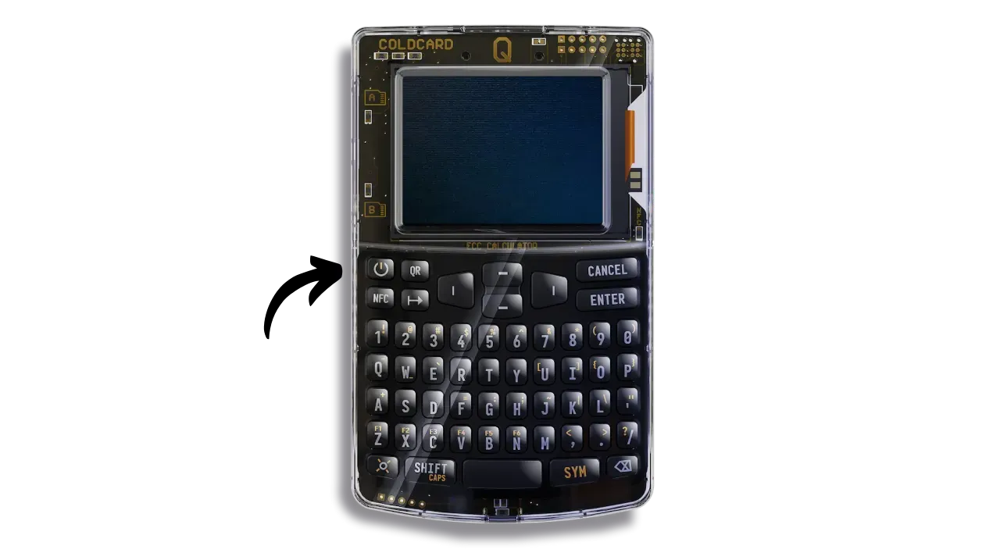
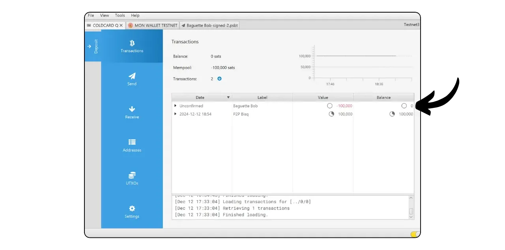

Un hardware wallet est un dispositif électronique dédié à la gestion et à la sécurisation des clés privées d'un portefeuille Bitcoin. Contrairement aux portefeuilles logiciels (ou portefeuilles chauds) installés sur des machines généralistes souvent connectées à Internet, les hardware wallets permettent d'isoler physiquement les clés privées, ce qui réduit les risques de piratage et de vol.

Le principal objectif d'un hardware wallet est de réduire au maximum les fonctionnalités de l'appareil afin de minimiser sa surface d'attaque. Moins de surface d'attaque, ça veut également dire moins de potentiels vecteurs d'attaque, c'est-à-dire moins de points faibles dans le système que les attaquants pourraient exploiter pour accéder aux bitcoins.

Il est recommandé d'utiliser un hardware wallet pour sécuriser vos bitcoins, surtout si vous en détenez des quantités importantes, que ce soit en valeur absolue ou en proportion de votre patrimoine total.

Les hardware wallets s’utilisent en combinaison avec un logiciel de gestion de portefeuille sur un ordinateur ou un smartphone. Ce dernier permet de gérer la création des transactions, mais la signature cryptographique nécessaire pour rendre valide ces transactions se fait uniquement au sein du hardware wallet. Cela signifie que les clés privées ne sont jamais exposées à un environnement potentiellement vulnérable.

Les hardware wallets offrent une double protection pour l'utilisateur : d'une part, ils sécurisent vos bitcoins contre les attaques à distance en gardant les clés privées hors ligne, et d'autre part, ils offrent généralement une meilleure résistance physique face aux tentatives d'extraction des clés. Et c'est justement sur ces 2 critères de sécurité que l'on peut juger et classer les différents modèles existants sur le marché.

Dans ce tutoriel, je vous propose de découvrir une de ces solutions : la **COLDCARD Q**.

---

Étant donné que la COLDCARD Q offre une multitude de fonctionnalités, je vous propose de diviser son utilisation en 2 tutoriels. Dans ce premier tutoriel, nous allons découvrir la configuration initiale et les fonctions de base de l'appareil. Ensuite, dans un second tutoriel, nous aborderons comment tirer parti de toutes les options avancées de votre COLDCARD.

https://planb.network/tutorials/wallet/hardware/coldcard-q-advanced-b8cc3f29-eea9-48fe-a953-b003d5b115e0

---

## Présentation de la COLDCARD Q

La COLDCARD Q est un hardware wallet Bitcoin-only développé par la société canadienne Coinkite, connue pour ses modèles MK précédents. La Q représente leur produit le plus avancé à ce jour, et se positionne comme le hardware wallet Bitcoin ultime.

Sur le plan matériel, la COLDCARD Q est équipée de toutes les fonctionnalités nécessaires pour une expérience utilisateur optimale :
- Un grand écran LCD qui simplifie la navigation et l'utilisation ;
- Un clavier complet en QWERTY ;
- Une caméra intégrée pour scanner des QR codes ;
- Deux emplacements pour cartes microSD ;
- Une option d'alimentation totalement isolée grâce à trois piles AAA (non incluses), ou via un câble USB-C ;
- Deux Secure Elements provenant de deux fabricants différents pour renforcer la sécurité ;
- La capacité de communiquer via NFC.

La COLDCARD Q seulement deux inconvénients selon moi. Tout d'abord, en raison de ses nombreuses fonctionnalités, elle est assez volumineuse, mesurant presque 13 cm de long et 8 cm de large, ce qui est quasiment la taille d'un petit smartphone. Elle est également assez épaisse à cause de l'emplacement pour les piles. Si vous recherchez un hardware wallet plus petit et plus mobile, la MK4, qui est beaucoup plus compacte, pourrait être une meilleure option. Le second inconvénient est évidemment le coût de l'appareil, qui est vendu à **$239.99** sur le site officiel, soit $72 de plus que la MK4, ce qui place la Q en concurrence directe avec les hardware wallets premium comme la Ledger Flex ou le Passport de Foundation.

Du côté logiciel, la COLDCARD Q est aussi bien équipée que les autres appareils de Coinkite, avec une multitude de fonctionnalités avancées :
- Dice Roll pour générer soi-même sa phrase de récupération ;
- Code PIN de contrainte ;
- Compte à rebours pour un verrouillage définitif du PIN ;
- BIP39 passphrase ;
- Code PIN de verrouillage définitif ;
- Compte à rebours de connexion ;
- SeedXOR ;
- BIP85...

En résumé, la COLDCARD Q offre une expérience utilisateur améliorée par rapport à la MK4 et peut être idéale pour des utilisateurs intermédiaires à avancés qui cherchent plus de confort d'utilisation.

La COLDCARD Q est disponible à la vente [sur le site officiel de Coinkite](https://store.coinkite.com/store/coldcard). Elle peut également être achetée en boutique physique chez un revendeur.

## Préparation du tutoriel

Une fois que vous avez reçu votre COLDCARD, la première étape consiste à inspecter l'emballage pour vous assurer qu'il n'a pas été ouvert. Si l'emballage est endommagé, cela peut indiquer que le hardware wallet a été compromis et pourrait ne pas être authentique.

Lors de l'ouverture, vous devriez trouver dans la boîte les éléments suivants :
- La COLDCARD Q dans un sac scellé ;
- Un carton pour noter votre phrase mnémonique.

Assurez-vous que le sac n'a pas été descellé ou endommagé. Vérifiez aussi que le numéro sur votre sac correspond au numéro sur le papier à l'intérieur du sac. Gardez ce numéro de côté, car il vous sera utile ultérieurement.

Si vous préférez alimenter votre COLDCARD sans la connecter à un ordinateur (air-gap), insérez trois piles AAA à l'arrière de l'appareil. Sinon, vous pouvez la connecter via un câble USB-C à votre ordinateur.

Pour ce tutoriel, vous aurez également besoin du logiciel Sparrow Wallet pour gérer votre portefeuille Bitcoin sur votre ordinateur. Téléchargez [Sparrow Wallet](https://sparrowwallet.com/download/) depuis le site officiel. Je vous conseille vivement de vérifier à la fois son authenticité (avec GnuPG) et son intégrité (via le hash) avant de procéder à l'installation. Si vous ne savez pas comment effectuer ces vérifications, suivez ce tutoriel :

https://planb.network/tutorials/others/general/integrity-authenticity-21d0420a-be02-4663-94a3-8d487f23becc

## Choix du code PIN

Vous pouvez maintenant allumer votre COLDCARD en appuyant sur le bouton en haut à gauche.

Appuyez sur le bouton "*ENTER*" pour accepter les conditions d'utilisation.

Votre COLDCARD Q affichera ensuite un numéro en haut de l'écran. Assurez-vous que ce numéro correspond à celui noté sur le sac scellé et sur le morceau de plastique contenu dans le sac. Cela garantit que votre colis n'a pas été ouvert entre le moment où il a été conditionné par Coinkite et votre ouverture. Appuyez sur "*ENTER*" pour continuer.

Naviguez jusqu'au menu "*Choose PIN Code*" et confirmez avec le bouton "*ENTER*".

Ce code PIN vous servira à déverrouiller votre COLDCARD. C'est donc une protection contre les accès physiques non autorisés. Ce code PIN n'intervient pas dans la dérivation des clés cryptographiques de votre portefeuille. Ainsi, même sans accès à ce code PIN, la possession de votre phrase mnémonique vous permettra de retrouver l'accès à vos bitcoins.

Les codes PIN des COLDCARD se divisent en deux parties : un préfixe et un suffixe, chacun pouvant comprendre entre 2 et 6 chiffres, pour un total de 4 à 12 chiffres. Lorsque vous déverrouillerez votre COLDCARD, vous devrez d'abord saisir le préfixe, après quoi l'appareil vous montrera 2 mots. Vous entrerez ensuite le suffixe. Ces deux mots vous seront donnés lors de cette étape de configuration et devront être soigneusement sauvegardés, car ils vous seront nécessaires à chaque déverrouillage de votre COLDCARD. Si les deux mots affichés lors du déverrouillage correspondent à ceux que vous avez enregistrés lors de la configuration, cela confirmera que votre appareil n'a pas été compromis depuis son dernier usage.

Cliquez de nouveau sur "*Choose PIN*"

Confirmez que vous avez pris connaissance des avertissements.

Vous allez maintenant choisir votre code PIN. Il est recommandé d'opter pour un code PIN long et aléatoire. Assurez-vous également de conserver ce code dans un lieu différent de celui où est stocké votre COLDCARD. Vous pouvez utiliser le carton fourni dans votre colis pour noter ce code.

Saisissez le préfixe de votre choix, puis appuyez sur le bouton "*ENTER*" pour confirmer cette première partie du code PIN.

Les deux mots anti-phishing vous seront ensuite affichés à l'écran. Sauvegardez-les soigneusement pour vous en rappeler plus tard. Vous pouvez utiliser le carton fourni dans votre colis pour les noter.

Entrez ensuite la seconde partie de votre code PIN et appuyez sur "*ENTER*".

Confirmez votre code PIN en le saisissant une seconde fois, tout en vérifiant que les deux mots anti-phishing correspondent à ceux que vous avez sauvegardés précédemment.

Dorénavant, à chaque déverrouillage de votre COLDCARD, pensez à vérifier la validité des deux mots anti-phishing qui s'affichent à l'écran après avoir saisi le préfixe de votre code PIN.

## Mise à jour du firmware

Lors de la première utilisation, il est important de vérifier et de mettre à jour le firmware de votre appareil. Pour cela, accédez au menu "*Advanced/Tools*".

**Important :** Si vous envisagez de mettre à jour votre firmware et que ce n'est pas votre première utilisation de la COLDCARD (c'est-à-dire que vous avez déjà un portefeuille créé sur la COLDCARD), assurez-vous de vérifier que vous avez bien votre phrase mnémonique et qu'elle est fonctionnelle (ainsi que la passphrase optionnelle, si applicable). Cette précaution est importante pour éviter de perdre vos bitcoins en cas de problème durant la mise à jour de l'appareil.

Sélectionnez "*Upgrade Firmware*".

Choisissez "*Show Version*".

Vous pouvez consulter la version actuelle du firmware de votre COLDCARD. Par exemple, dans mon cas, la version est "*1.2.3Q*".

Vérifiez [sur le site officiel de COLDCARD](https://coldcard.com/downloads) si une version plus récente est disponible. Cliquez sur "*Download*" pour télécharger le nouveau firmware.

À ce stade, il est fortement recommandé de vérifier l'intégrité et l'authenticité du firmware téléchargé. Pour ce faire, téléchargez [le document contenant les hash de toutes les versions, signé par les développeurs](https://raw.githubusercontent.com/Coldcard/firmware/master/releases/signatures.txt), vérifiez la signature avec [la clé publique du développeur](https://keybase.io/dochex), et assurez-vous que le hash indiqué dans le document signé correspond à celui du firmware téléchargé sur le site. Si tout est correct, vous pouvez procéder à la mise à jour.

Si vous n'êtes pas familier avec ce processus de vérification, je vous recommande de suivre ce tutoriel :

https://planb.network/tutorials/others/general/integrity-authenticity-21d0420a-be02-4663-94a3-8d487f23becc

Munissez-vous d'une carte microSD et transférez-y le fichier firmware (document en `.dfu`). Insérez la carte microSD dans l'un des ports de votre COLDCARD.

Ensuite, dans le menu de mise à jour du firmware, sélectionnez "*From MicroSD*".

Choisissez le fichier correspondant au firmware.

Confirmez la sélection en appuyant sur le bouton "*ENTER*".

Patientez pendant la mise à jour du firmware.

Une fois la mise à jour terminée, entrez votre code PIN pour déverrouiller l'appareil.

Votre firmware est désormais à jour.

## Les paramètres de la COLDCARD Q

Si vous le souhaitez, vous pouvez explorer les paramètres de votre COLDCARD en accédant au menu "*Settings*".

Dans ce menu, vous trouverez diverses options de personnalisation, comme le réglage de la luminosité de l'écran ou la sélection de l'unité de mesure par défaut.

Nous aborderons les autres paramètres avancés dans le prochain tutoriel :

https://planb.network/tutorials/wallet/hardware/coldcard-q-advanced-b8cc3f29-eea9-48fe-a953-b003d5b115e0

## Création du portefeuille Bitcoin

Il est maintenant temps de générer un nouveau portefeuille Bitcoin ! Pour cela, il faut créer une phrase mnémonique. Sur les Coldcard, vous avez trois méthodes pour générer cette phrase :
- Utiliser uniquement le générateur de nombres aléatoires interne (TRNG) ;
- Utiliser une combinaison du TRNG et de lancers de dés pour ajouter de l'entropie ;
- Utiliser uniquement des lancers de dés.

**Pour les utilisateurs débutants et intermédiaires, il est conseillé d'utiliser uniquement le générateur de nombres aléatoires interne de la COLDCARD.**

Je déconseille l'option des dés seuls, car une mauvaise réalisation peut conduire à une phrase avec une entropie insuffisante, mettant en péril la sécurité de votre portefeuille.

En revanche, la meilleure option est sûrement la seconde, qui combine l'usage du TRNG avec une source d'entropie externe. Cette méthode garantit une entropie minimale équivalente à celle du TRNG seul et ajoute un niveau de sécurité supplémentaire en cas d'éventuelle défaillance du générateur interne (volontaire ou non). En choisissant cette option qui combine TRNG et lancers de dés, vous bénéficiez de plus de contrôle sur la génération de la phrase, sans pour autant augmenter les risques en cas de mauvaise réalisation de votre part.

Cliquez sur "*New Seed Words*".

Vous pouvez choisir la longueur de votre phrase. Je vous recommande d'opter pour une phrase de 12 mots, car elle est moins complexe à gérer et elle n'offre pas moins de sécurité qu'une phrase de 24 mots au niveau du portefeuille.

La COLDCARD affichera ensuite votre phrase de récupération générée par le TRNG. Si vous voulez y ajouter une entropie externe supplémentaire, appuyez sur la touche "*4*".

Vous accéderez à une page où vous pourrez ajouter de l'entropie par des lancers de dés. Effectuez autant de lancers que possible (un minimum de 50 est conseillé, mais en faire moins n'est pas très grave puisque vous bénéficiez déjà de l'entropie du TRNG), et enregistrez les résultats avec les touches de "*1*" à "*6*". Une fois terminé, appuyez sur "*ENTER*" pour confirmer.

Une nouvelle phrase mnémonique sera affichée, basée sur l'entropie que vous venez de fournir et sur celle du TRNG.

**Attention : Cette phrase mnémonique donne un accès complet et non restreint à tous vos bitcoins**. N'importe qui en possession de cette phrase peut subtiliser vos fonds, même sans accès physique à votre COLDCARD. La phrase de 12 mots permet de restaurer l'accès à vos bitcoins en cas de perte, vol ou casse de votre COLDCARD. Il est donc très important de la sauvegarder soigneusement et de la stocker dans un endroit sécurisé.

Vous pouvez l'inscrire sur le papier cartonné fourni avec votre COLDCARD, ou bien pour plus de sécurité, je vous recommande de la graver sur un support en acier inoxydable afin de la protéger contre les risques d'incendies, d'inondations ou d'écroulements. Dans tous les cas, ne la sauvegardez jamais sur un support numérique, sans quoi vous pourriez perdre vos bitcoins.

Notez les mots fournis sur l'écran sur le support physique de votre choix. Selon votre stratégie de sécurisation, vous pouvez envisager de réaliser plusieurs copies physiques complètes de la phrase (mais surtout, ne la divisez pas). Il est important de conserver les mots numérotés et dans l'ordre séquentiel.

Évidemment, **vous ne devez jamais partager ces mots** sur internet, contrairement à ce que je fais dans ce tutoriel. Ce portefeuille en exemple sera utilisé uniquement sur le Testnet et sera supprimé à l'issue du tutoriel.

Après avoir noté les mots, appuyez sur "*ENTER*".

Pour vérifier que vous avez correctement sauvegardé votre phrase, le système vous demandera de confirmer certains mots. Sélectionnez le numéro correspondant à chaque mot demandé sur le clavier.

Votre portefeuille est maintenant créé ! Vous pouvez voir en haut à droite de l'écran votre empreinte de clé privée maîtresse. Appuyez sur "*ENTER*".

Vous accédez maintenant au menu principal de votre COLDCARD.

## Configurer un nouveau portefeuille sur Sparrow

Pour établir une communication entre le logiciel Sparrow Wallet et votre COLDCARD, vous disposez de plusieurs options. La plus directe est l'utilisation d'un câble USB-C. Toutefois, par défaut, votre COLDCARD a les communications par câble et par NFC désactivées. Pour les réactiver, naviguez dans "*Settings*", puis "*Hardware On/Off*", et activez l'option de communication souhaitée.

Si vous préférez maintenir votre COLDCARD totalement isolée de votre ordinateur, vous pouvez opter pour une communication indirecte en "*Air-Gap*", en utilisant des QR codes ou une carte microSD. C'est cette méthode que nous utiliserons dans ce tutoriel.

Dirigez-vous vers "*Advanced/Tools*".

Choisissez "*Export Wallet*".

Sélectionnez ensuite "*Sparrow Wallet*".

Appuyez sur "*ENTER*" pour générer le fichier de configuration.

Choisissez ensuite comment transmettre ce fichier à Sparrow. Dans cet exemple, j'ai inséré une microSD dans l'emplacement "*A*", donc je vais sélectionner le bouton "*1*". Vous pouvez également afficher les informations sous forme de QR code sur l'écran de votre COLDCARD en appuyant sur le bouton "*QR*", et scanner ce QR code avec la webcam de votre ordinateur.

Lancez Sparrow Wallet et passez les pages d'introduction pour arriver à l'écran principal. Assurez-vous d'être correctement connecté à un nœud en vérifiant l'interrupteur situé en bas à droite de l'écran.

Il est fortement recommandé d'utiliser votre propre nœud Bitcoin. Pour ce tutoriel, j'utilise un nœud public (jaune), car je suis sur le testnet, mais pour une utilisation en production, il est préférable d'utiliser Bitcoin Core en local (vert) ou un serveur Electrum sur un nœud distant (bleu).

Accédez au menu "*File*" et sélectionnez "*New Wallet*".

Nommez votre portefeuille et cliquez sur "*Create Wallet*".

Dans le menu déroulant "*Script Type*", choisissez le type de script qui sécurisera vos bitcoins.

Cliquez sur "*Airgapped Hardware Wallet*".

Sous l'onglet "*Coldcard*", cliquez sur "*Scan...*" si vous prévoyez de scanner le QR code affiché sur votre COLDCARD, ou "*Import File...*" pour importer le fichier depuis la microSD (c'est le fichier `.json`).

Après l'importation, vérifiez que la "*Master fingerprint*" affichée sur Sparrow correspond à celle affichée sur votre COLDCARD. Confirmez la création en cliquant sur "*Apply*".

Définissez un mot de passe robuste pour sécuriser l'accès à votre portefeuille sur Sparrow Wallet. Ce mot de passe protégera vos clés publiques, vos adresses, vos étiquettes, et l'historique de vos transactions contre les accès non autorisés.

Il est recommandé de sauvegarder ce mot de passe pour éviter de l'oublier (par exemple dans un gestionnaire de mots de passe).

Votre portefeuille est maintenant configuré sur Sparrow Wallet.

Avant de recevoir vos premiers bitcoins sur votre portefeuille, **je vous conseille vivement de réaliser un test de récupération à vide**. Notez une information de référence, telle que votre xpub, puis réinitialisez votre COLDCARD Q tant que le portefeuille est encore vide. Ensuite, essayez de restaurer votre portefeuille sur la COLDCARD en utilisant vos sauvegardes papier. Vérifiez que la xpub générée après la restauration correspond à celle que vous aviez notée initialement. Si c'est le cas, vous pouvez être assuré que vos sauvegardes papier sont fiables.

Pour en savoir plus sur comment effectuer un test de récupération, je vous conseille de consulter cet autre tutoriel :

https://planb.network/tutorials/wallet/backup/recovery-test-5a75db51-a6a1-4338-a02a-164a8d91b895

## Recevoir des bitcoins

Pour recevoir vos premiers bitcoins, commencez par allumer et déverrouiller votre COLDCARD.

Sur Sparrow Wallet, cliquez sur l'onglet "*Receive*".

Avant d'utiliser l'adresse proposée par Sparrow Wallet, vérifiez-la sur l'écran de votre COLDCARD. Cette pratique vous permet de confirmer que l'adresse affichée sur Sparrow n'est pas frauduleuse et que le hardware wallet détient bien la clé privée nécessaire pour dépenser ultérieurement les bitcoins sécurisés avec cette adresse. Cela vous permet d'éviter plusieurs types d'attaques.

Pour effectuer cette vérification, cliquez sur le menu "*Address Explorer*" sur la COLDCARD.

Sélectionnez le type de script que vous utilisez sur Sparrow. Dans mon cas, c'est du Segwit P2WPKH. Je clique donc dessus.

Vous pouvez ensuite voir vos différentes adresses dérivées dans l'ordre.

Vérifiez sur Sparrow que l'adresse correspond bien. Dans mon cas, l'adresse avec le chemin de dérivation `m/84'/1'/0'/0/0` est bien `tb1qwfwwvzssep4wyjg3vsgezmwa037ehvd4fhmjvr` à la fois sur Sparrow et sur la COLDCARD.

Une autre méthode pour vérifier la possession de cette adresse consiste à scanner son QR code directement sur Sparrow à partir de votre COLDCARD. Depuis l'écran d'accueil de votre COLDCARD, sélectionnez "*Scan Any QR Code*". Vous pouvez également utiliser la touche "*QR*" sur le clavier.

Scannez le QR code de l'adresse affichée sur Sparrow Wallet.

Assurez-vous que l'adresse affichée sur votre COLDCARD correspond à celle indiquée sur Sparrow. Ensuite, appuyez sur le bouton "*1*".

L'adresse est ainsi confirmée avec succès.

Vous pouvez maintenant ajouter un "*Label*" pour décrire la source des bitcoins qui seront sécurisés avec cette adresse. C'est une bonne pratique qui vous permet de mieux gérer vos UTXOs.

Pour plus d'informations sur l'étiquetage, je vous conseille également de découvrir cet autre tutoriel :

https://planb.network/tutorials/privacy/on-chain/utxo-labelling-d997f80f-8a96-45b5-8a4e-a3e1b7788c52

Vous pouvez ensuite utiliser cette adresse pour recevoir des bitcoins.

## Envoyer des bitcoins

Maintenant que vous avez reçu vos premiers sats sur votre portefeuille sécurisé avec la COLDCARD, vous pouvez également les dépenser !

Comme à chaque fois, commencez par allumer et déverrouiller votre COLDCARD Q, puis ouvrez Sparrow Wallet et naviguez jusqu'à l'onglet "*Send*" pour préparer une nouvelle transaction.

Si vous souhaitez faire du "*coin control*", c'est-à-dire choisir spécifiquement quels UTXOs consommer dans la transaction, rendez-vous dans l'onglet "*UTXOs*". Sélectionnez les UTXOs que vous souhaitez dépenser, puis cliquez sur "*Send Selected*". Vous serez redirigé vers le même écran de l'onglet "*Send*", mais avec vos UTXOs déjà sélectionnés pour la transaction.

Entrez l'adresse de destination. Vous pouvez également entrer plusieurs adresses en cliquant sur le bouton "*+ Add*".

Notez un "*Label*" pour vous souvenir de l'objet de cette dépense.

Choisissez le montant envoyé à cette adresse.

Ajustez le taux de frais de votre transaction en fonction du marché du moment.

Assurez-vous que tous les paramètres de votre transaction sont corrects, puis cliquez sur "*Create Transaction*".

Si tout vous convient, cliquez sur "*Finalize Transaction for Signing*".

Une fois votre transaction construite dans Sparrow, il est temps de la signer avec votre COLDCARD. Pour transmettre le PSBT (transaction non signée) à votre appareil, vous avez plusieurs options. Si la transmission de données par câble est activée, vous pouvez envoyer la transaction directement via une connexion USB-C, comme vous le feriez avec un autre hardware wallet. Dans ce cas, sur Sparrow, il faudrait cliquer sur le bouton "*Sign*" situé en bas à droite. Dans mon exemple, ce bouton est bloqué car la COLDCARD n'est pas connectée par câble.

Si vous préférez maintenir une connexion "*Air-Gap*" sans contact direct entre le hardware wallet et votre ordinateur, 2 options s'offrent à vous. La première, plus complexe, consiste à utiliser une carte microSD. Insérez la carte microSD dans votre ordinateur, enregistrez la transaction via le bouton "*Save Transaction*" sur Sparrow, puis transférez cette carte dans un port de votre COLDCARD.

Accédez ensuite au menu "*Ready To Sign*".

Examinez les détails de la transaction sur votre COLDCARD, notamment l'adresse de réception, le montant envoyé et les frais de transaction.

Si tout est correct, appuyez sur le bouton "*ENTER*" pour signer la transaction.

Replacez ensuite la microSD dans votre ordinateur et sur Sparrow, cliquez sur "*Load Transaction*" pour charger la transaction signée depuis la microSD. Vous pourrez faire une dernière vérification avant de la diffuser sur le réseau Bitcoin.

La seconde méthode pour signer avec votre COLDCARD en Air-Gap, qui est bien plus simple que la méthode avec la microSD, consiste à scanner directement la PSBT via la caméra de l'appareil. Sur Sparrow, sélectionnez "*Show QR*".

Sur la COLDCARD, choisissez "*Scan Any QR Code*". Vous pouvez également utiliser la touche "*QR*" sur le clavier.

Utilisez la caméra de la COLDCARD pour scanner le QR code affiché sur Sparrow.

Les détails de la transaction apparaîtront de nouveau pour vérification. Appuyez sur "*ENTER*" pour signer si tout vous convient.

Votre COLDCARD affichera alors la transaction signée sous forme de QR code. Utilisez la webcam de votre ordinateur pour scanner ce QR code en sélectionnant "*Scan QR*" sur Sparrow.

Votre transaction signée est maintenant visible sur Sparrow. Vérifiez une dernière fois que tout est correct, puis cliquez sur "*Broadcast Transaction*" pour la diffuser sur le réseau Bitcoin.

Vous pourrez suivre votre transaction dans l'onglet "*Transactions*" de Sparrow Wallet.

Félicitations, vous êtes maintenant au point sur l'utilisation de base de la COLDCARD Q avec Sparrow Wallet !

Si vous avez trouvé ce tutoriel utile, je vous serais très reconnaissant de laisser un pouce vert ci-dessous. N'hésitez pas à partager ce tutoriel sur vos réseaux sociaux. Merci beaucoup !

Je vous conseille également de découvrir cet autre tutoriel dans lequel nous abordons les options avancées de la COLDCARD Q :

https://planb.network/tutorials/wallet/hardware/coldcard-q-advanced-b8cc3f29-eea9-48fe-a953-b003d5b115e0
